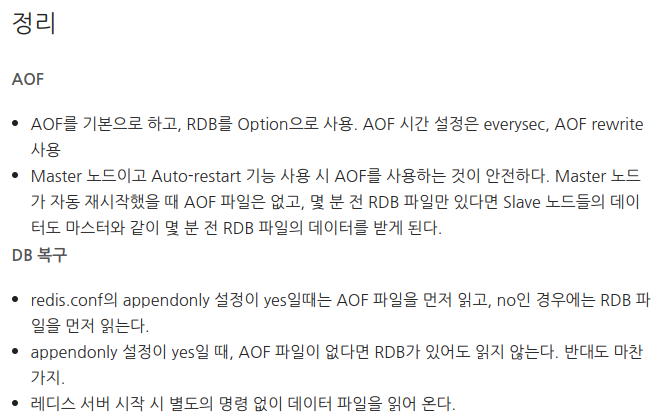

# Redis

[Redis 우아한테크세미나.pdf](Database,%20JPA%200ab448a7c6d44a04ba92b364ba0b6f70/Redis.pdf)

[1. Redis 구조](https://cla9.tistory.com/101)

## Redis란?

- 인메모리 데이터 저장소 오픈소스
- String, set ,sorted-set, hashes, list 등 다양한 타입 지원
- 영속성을 지원하는 인메모리 데이터 저장소
    - 데이터는 디스크에도 저장되서 불의의 경우에도 데이터 복구가 가능하기 때문
    - 두가지 방식으로 저장
        - Snapshot(RDB) : 어떤 특정 시점의 데이터를 Disk에 옮겨담는 방식
        - AOF : Redis의 write/update 연산 자체를 모두 log 파일에 기록하는 형태
- 서버 측 복제 : 슬레이브(Slave) 서버와 마스터(Master) 서버
  
    - Redis가 실행중인 서버가 충돌하는 경우 장애 조치 처리와 함께 더 높은 읽기 성능을 지원하기 위해 전체 데이터베이스의 초기 복사본을 받는 마스터 / 슬레이브 복제를 지원
    - 마스터 업데이트 시 슬레이브도 실시간으로 업데이트

### Redis 장점
- 리스트, 배열과 같은 데이터를 처리하는데 유용하다.
    - value 값으로 문자열, 리스트, Set, Sorted set, Hash 등 여러 데이터 형식을 지원하기에, 다양한 방식으로 데이터를 활용할 수 있다.
- 리스트형 데이터 입력과 삭제가 MySQL에 비해서 10배정도 빠르다고 한다.
- 여러 프로세스에서 동시에 같은 key에 대한 갱신을 요청할 경우, Atomic 처리로 데이터 부정합 방지 Atomic처리 함수를 제공한다.(원자성을 잘 지킨다)
- 메모리를 활용하면서 영속적인 데이터 보존
    - 명령어로 명시적으로 삭제, expires를 설정하지 않으면 데이터가 삭제되지 않는다.스냅샷(기억장치) 기능을 제공하여 메모리의 내용을 *.rdb 파일로 저장하여 해당 시점으로 복구할 수 있다.
- Redis Server는 1개의 싱글 쓰레드로 수행되며, 따라서 서버 하나에 여러개의 서버를 띄우는 것이 가능하다.
    - Master — Slave 형식으로 구성으로 데이터 분실 위험을 없애줄 수 있음

### Cache 구조
- Look asid Cahce: 캐시에 자료가 없으면, DB 접근 후 캐시에 갱신
  
- Wirte Back: 캐시에 쓰고, 모아서 DB에 저장
  

### RDB vs AOF

## 왜 Collection이 중요한가?
랭킹 서버를 직접 구현한다면?
- DB에 유저 Score를 저장하고 Order by로 정렬 후 읽어오기-> 디스크에 접근함으로 성능이슈 발생 할 수 있음
    - Redis의 `Soreted Set`을 이용하면, 랭킹을 쉽게 구현 가능
        - Replication도 쉽게 가능
- 친구 리스트를 Key/Value 형태로 관리한다면?동시성 이슈 발생 가능
  
    - Redis는 자료구조가 Atomic하기 때문에 Race Condition을 피할 수 있다.
- 결론: Collection을 잘 이용하는 것으로, 여러가지 개발 시간을 단축시키고, 문제를 줄여줄 수 있다.

### Redis 사용사례
- Remote Data Store: 여러 서버에서 데이터를 공유하고 싶을 때
- 인증 토큰, Ranking 보드(Sorted Set), 유저 API Limit, Job que 등

### Redis Collections
- 하나의 컬렉션에 너무 많은 아이템을 담으면 좋지 않음
    - 만개 이하 몇천개 수준으로 유지하는게 좋음
- Expire는 Collection의 item 개별로 걸리지 않고 전체 Collection에 대해서만 걸림

## Redis 운영
### 메모리 관리를 잘하자
- Physical Memory 이상을 사용하면 문제가 발생 
- Swap이 있다면 Swap 사용으로 해당 메모리 Page 접근시 마다 늦어짐.
    - Swap이 없다면 추가 메모리를 해제할 수 없기에 OOM(Out Of Memory) 오류
- Maxmemory를 설정하더라도 메모리 할당 구현체에 메모리 관리 의존, 따라서 레디스는 정확한 메모리 사용량을 알 수없어 이보다 더 사용할 가능성이 큼.
    - 메모리 파편화가 발생할 수 있음.
- 큰 메모리의 instance 하나보다 적은 메모리 instance 여러개가 안전
  
    - 레디스는 FORK를 하는데, copy on wirte기반이라 write가 헤비한 레디스는 최대 메모리 두배까지 쓸 수 있다.
- 다양한 사이즈를 가지는 데이터보다는 유사한 크기의 데이터를 저장하는 경우가 유리

### 메모리가 부족할 때는?
- Cache is cash
    - 좀 더 메모리 많은 장비로 Migration
    - 메모리가 빡빡하면 Migration중에 문제가 발생 할 수도 (60~70% 사용중이면 이전 고려)
- 있는 데이터 줄이기
    - 데이터를 일정 수준에서만 사용하도록 특정 데이터를 줄임
    - 다만 이미 Swap을 사용중이라면, 프로세스를 재시작 해야함
- 기본적으로 Collection 들은 다음과 같은 자료구조 사용
    - Hash -> HashTable을 하나 더 사용
    - Sorted Set -> Skiplist와 Hash Table을 이용
    - Set -> HashTable 사용
- 위 자료구조들은 메모리들을 생각보다 많이 사용함, 그래서 `Ziplist`를 활용하는 방법도 있다.
    - Ziplist는 선형으로 저장, In-Memory 특성 상, 적은 개수라면 선형탐색을 하더라도 빠르다.

### O(N) 관련 명령어는 주의하자
- Redis는 Single Thread라 하나의 요청이 병목되면 뒤에 요청들도 계속 기다려야한다.
  > 단순한 get/set의 경우 초당 10만 TPS 이상 가능

- Packet 단위로 받아 하나의 Command가 완성되면 실행되는 구조.

### 대표적인 O(N) 명령 및 사례
- KEYS, FLUSHALL, FLUSHDB, Delete COLECTIONS, Get All Collections
- 모니터링 스크립트가 일초에 한번씩 keys 호출..
- 큰 컬렉션의 데이터를 다 가져오는 경우
- Spring security oauth RedisTokenStore(최신 버전은 패치됨)Access Token 저장을 List(O(N)) 자료구조를 통해서 이루어짐 -> 삭제시에 모든 item을 찾아봐야함, 최근에는 Set을 통해 가져오도록 패치됨
- keys는 scan 명령어로 사용하는 것으로 하나의 긴명령을 짧은 여러 명령으로 변경 가능

## Redis Replication
- Async Replication -> Replication Lag이 발생 할 수 있다.
- DBMS로 보면 statement replication과 유사 --> 쿼리가 직접 간다.

### Replication 설정 과정
- Secondary에 replicaof or slaveof 명령 전달
- Secondary는 Primary에 sync 명령 전달
- Primary는 현재 메모리 상태를 저장하기 위해 Fork
  > 요 과정에서 copy on wirte가 발생 할 수 있음
- Fork 한 프로세서는 현재 메모리 정보를 disk에 dump (disk 대신 메모리에서 바로 줄 수도 있음)
- Fork 이후의 데이터를 secondary에 계속 전달
  > AWS나 클라우드의 Redis는 다르게 구현되어 있어서 좀 더 안정적일 수 있다.

## redis.conf 권장설정
- Maxclient 설정 50000
- Maxclient 수만큼만 접속 가능
- RDB/AOF 설정 off
- 특정 commands disable
- 전체 장애의 90% 이상이 KEYS와 SAVE 설정을 사용해서 발생
  > save 설정은 1초안에 키가 ~~개 바뀌면 dump 해!라는 설정

## Redis 데이터 분산
### Consistent Hashing
- 일반 모듈러 해싱은 서버가 장애/추가 될 때마다 여러 서버에서 걸쳐 데이터 리밸런싱이 일어난다.
- Consistent Hashing은 자기 해시보다 크고 가장 근접한 해시를 가진 서버 찾아간다. 따라서 서버 장애/추가 될 때에 N분의 1만큼만 이동하게 된다.

### Sharding
- Range: 특정 Range를 정의하고 속하는 Range에 저장 --> 데이터가 일정 Range에 몰리거나 비어있을 수 있다.
- Modular를 사용할 경우 하나씩 추가하면 데이터 리벨린싱이 빈번하게 발생함으로 *2만큼 늘려준다면, 규칙적으로 데이터들이 이동한다.
- Indexed: 해당 key가 어디에 저장되어야 할 관리 서버가 따로 존재, 단 인덱스 서버가 죽으면 심각한 장애

### Redis Cluster
- Hash 기반으로 Slot 16384로 구분
- slot = crc16(key) % 16384
- Key가 Key{hashKey} 패턴이며 crc 16에 hash key가 적용된다. 따라서 key값 설정으로 보낼 서버를 정할 수도 있다.
- Redis 서버는 slot range를 가지고 있기때문에 slot 단위로 데이터를 다른 서버로 전달하게 된다.
- 자기 slot 외에 데이터가 들어오면 -Moved {서버} 에러를 보낸다. 라이브러리는 이 에러를 받고 해당하는 서버로 옮겨 줘야한다.

### Redis Cluster 장단점
- 장점
    - 자체적인 Primary, Secndary Failover.
    - Slot 단위의 데이터 관리
- 단점
    - 메모리 사용량이 더 많음
    - Migration 자체는 관리자가 시점을 결정해야함
    - Library 구현이 필요함

## Redis Failover
### Redis Cluster
> 위에서 설명함

### Coordinator 기반 Failover
- Zookeeper, etcd 등의 코디네이터 사용

- Coordinator 기반으로 설정을 관리한다면 동일한 방식으로 관리가 가능
- 해당 기능을 이용하도록 개발이 필요

### VIP(DNS) 기반
- 서버가 죽으면 승격된 레디스에 죽은 서버의 vip를 할당해준다.
- Health Checker는 죽은 서버의 연결을 모두 끊어 클라이언트의 재접속을 유도한다.
- 클라이언트에 추가적인 구현이 필요없다
- DNS 기반은 DNS Cache TTL을 관리해야한다.
- 클라이언트가 DNS를 캐싱해버리면 접속이 안될 수 있다.
- VIP 기반은 외부로 서비스를 제공해야하는 서비스 업자에 유리
- DNS 변경은 VIP 변경보다 훨씬 간단하다.

### Monitoring
- Redis Info를 통한 정보
    - RSS : 피지컬 메모리를 얼마나 쓰고 있냐, OS가 보고 있는 지표
    - Used Memory: 레디스가 알고 있는 사용 메모리
    - Connection 수: 레디스는 싱글 스레드라 컨넥션을 계속 맺고 해제하면 성능이 급격하게 떨어질 수 있다.
    - 초당 처리 요청수
- System
    - CPU: 초당 처리 요청수는 짧은 명령이라면 CPU에 영향을 받는다.
    - Disk
    - Network rt/tx: 스위치에서 너무 많은 데이터가 있으면 drop이 일어날 수 있어서 확인 필요
- CPU가 100%를 칠 경우
    - 레디시는 싱글 스레드라 CPU 하나를 사용, 따라서 CPU 단일 성능을 높이는게 좋음
    - O(N) 계열의 특정 명령이 많은 경우
        - Monitor 명령을 통해 특정 패턴을 파악하는 것이 필요
        - Monitor 잘못쓰면 부하로 해당 서버에 더 큰 문제 발생 할 수 있음. 짧게 쓰는게 좋다
          > Monitor는 명령어 패턴을 확인 할 수 있는 명령어

## 결론
- 기본적으로 Redis는 매우 좋은 툴
- 그러나 메모리를 빡빡하게 쓸 경우, 관리하기가 어려움
    - 32기가 장비일 때 24기가 이상을 사용한다면 장비 증설을 고려
- Client-output-buffer-limit 설정이 필요

### Redis as Cache
- Cache 일 경우는 문제가 적게 발생
    - Redis가 문제가 있을 때 DB등의 부하가 어느정도 증가하는지 확인 필요
    - Consistent Hashing도 실제 부하를 아주 균등하게 나누지는 않음. Adaptive Consistent Hasing을 이용해 볼 수도 있음

### Redis as Persistent Store
- Persistent Store의 경우
    - 무조건 Primary/Secondary 구조로 구성이 필요
    - 메모리를 절대로 빡빡하게 사용하면 안됨
        - 정기적인 Migration이 필요
        - 가능하면 자동화 툴을 만들어서 이용
    - RDB/AOF가 필요하다면 Secondary에서만 구동
        - AOF가 여러번 작게 발생하기에 좀 더 안정적