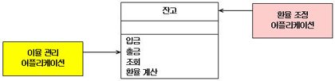

# 객체지향 5원칙 SOLID

# Single Responsesiblity Principle(단일 책임 원칙)

오래 전 질레트가 여러 분야로 사업을 다각화한 적이 있다. 자신의 경쟁력 있는 분야인 면도날, 면도기 사업을 벗어나 샴푸 등 일용품 사업에까지 뛰어든 것이다. 면도용품도 일용품이니 사업분야 간 시너지 효과가 있을 것이라는 판단이었던 듯하다.

하지만 실적은 나지 않았고 주가는 곤두박질쳤으며 결국은 많은 손실을 입은 채로 다각화한 사업분야를 정리해야만 했다. 현재는 면도용품 사업에 집중해서 세계 최고의 면도용품 회사라는 명성과 실적을 되찾게 되었다.

이처럼 많은 기업들이 위험을 분산시키고 실적을 향상시키기 위해서 다각화(diversification)를 한다. 하지만 많은 경우 다각화는 오히려 위험을 증가시키고 실적을 악화시킨다. 이를 들어 월 스트리트의 전설적인 투자가로 불리는 피터 린치(Peter Lynch)는 “다각화는 대부분 다악화(diworsfication)로 끝난다”고 충고한다. 실제 그는 자신의 포트폴리오에 다각화를 시도하는 기업은 가능한 배제하며, 경험상 이러한 결정을 후회한 적은 거의 없다고 자신 있게 말한다.

스탠포드의 짐 콜린스 교수는 피터 린치의 경험을 트럭 수십 대에 해당하는 자료를 분석한 결과로 지지해 준다. 그의 연구에 따르면 위대한 기업으로 도약한 기업들은 모두가 우직하게 한 우물을 팠다고 한다. 다음은 그가 좋은 기업에서 위대한 기업으로란 책에서 ‘예상치 못한 발견’이라 놀라며 서술한 내용이다.

“좋은 회사에서 위대한 회사로 도약한 기업들은 고슴도치 - ‘한 가지’만 알고 그것에 집중하는 단순하고 촌스러운 동물-에 가깝다. 비교 기업들은 여우 - 많은 것을 알지만 일관성이 결여된 꾀 많고 교활한 동물-에 가깝다.”

어떤 단일 조직이 여러 분야로 다각화하게 되면 조직 내에서 다른 목표를 추구하는 사람들 간의 이질감이 발생하고 또한 한 가지에 집중하지 못하고 힘이 흩어지기 때문에 다각화는 쉽사리 다악화로 변질된다. 소프트웨어 세계에서도 이와 비슷하게 다각화를 경계하라는 원리가 있다. 바로 **하나의 클래스는 하나의 책임만을 가져야 한다는 ‘단일 책임 원칙(이하 SRP)’**이다.

이번 글에서는 프로그램에서 객체가 가지는 책임이란 것이 무엇인지, 그리고 왜 객체가 단일 책임만 가지는 것이 좋은지를 살펴볼 것이다. 또한 현재 객체가 이미 여러 책임을 지니고 있는 여우 객체인 경우 나타날 수 있는 문제점(악취)과 이를 고슴도치 객체로 바꾸는 방법에 대해서도 논의해 본다.

**단일 책임 원칙의 개요**

**다음은 국제 거래 은행에서 사용하는 ‘잔고’라는 클래스이다.** 잔고 클래스는 다음과 같은 인터페이스를 갖는다. 이 클래스의 인터페이스는 직관적으로 단순하고 기능적으로 완결된 클래스일 수 있다. **하지만 만약 두 개의 서로 다른 애플리케이션이 잔고 클래스를 사용한다고 했을 때 이 두 사용자 클래스는 서로 다른 메쏘드를 이용하게 된다. 환율 조정 애플리케이션은 ‘환율 계산’ 메쏘드를 이용할 것이고 이율 관리 애플리케이션은 금액에 관한 인터페이스를 이용할 것이다.**

하지만 이 **각 애플리케이션이 각각 배포됐을 때 잔고 클래스는 정체성의 혼란이 생긴다. 왜냐하면 이율관리 애플리케이션에 배포될 때는 ‘환율 계산’ 메쏘드가 무용하게 되고 환율 조정 애플리케이션과 배포될 때는 금액에 관한 인터페이스가 소외되기 때문이다. 문제는 여기서 그치지 않는다. 만약 환율 계산 메쏘드의 시그니처가 변경될 경우 환율 계산을 요청하는 잔고 클래스의 다른 메쏘드들이 같이 변경되어야 한다.** 간결하게 설계한 잔고 클래스는 확실히 문제를 내장하고 있었다.



문제의 원흉은 무엇일까? **잔고 클래스는 사실은 두 가지 책임을 가지고 있다. 수리적 이율 연산을 담당하는 ‘환율 계산’의 책임과 금액에 관련한 처리를 담당하는 메쏘드들이 또 다른 책임이다. 또한 하나의 클래스 안에 필요에 의해 두 가지 책임이 공존할 때 서로의 의존관계는 심각하게 강결합되기 때문에 변경에 대한 충격이 전달될 수밖에 없다.**

확실히 두 가지 책임을 담당해야 하는 한 클래스는 불편한 점이 많다. 지난 글에 소개한 OCP는 ‘확장’이 설계적 관전 포인트라면 단일 책임 원칙(Single Responsibility Principle : SRP)은 ‘변경’이 관전 포인트가 될 것이다. 이 ‘변경’의 거북함을 조장하는 요소는 서로 다른 ‘책임’이 혼재해 있다는데 있다.

**SRP의 키워드는 책임으로 요약되는데, 그렇다면 책임이란 무엇일까? 책임이란 ‘변경을 위한 이유’이다. 만약 하나의 클래스에 변경을 위한 두 가지 이상의 이유가 있다면 그 클래스는 한 가지 이상의 책임을 갖고 있는 것이다. <그림 1>의 잔고 클래스는 변경의 내용이 두 가지로 요약된다. 금액과 환율이다. 즉, 잔고 클래스는 금액과 환율의 책임을 갖고 있다.**

**SRP는 하나의 클래스에 한 가지 책임을 가르치는 원칙이다.** 우리는 설계 관점에서 우리가 인식하지 못하는 SRP 위반을 자주 하게 된다. 이 위반을 경계하기 위해 깊은 통찰력이 필요하지도 않다. 단지 머리에 ‘책임’이란 단어를 상기하는 습관이면 된다.

위반 사항에는 대가가 따른다. **SRP를 위반할 경우** 따르는 재앙은 첫 번째로 ‘왕따’가 발생한다는 것이다. 잔고 클래스가 이율 관리 애플리케이션과 배포됐을 때 확실히 ‘환율 계산’ 메쏘드는 소외된다**. 즉 만약 A라는 책임과 B라는 책임을 갖고 있는 클래스가 있을 경우 A만 필요로 하는 애플리케이션은 항상 B를 들고 다녀야 한다.**

문제는 여기서 그치지 않는다. **두 번째 재앙은 무관한 메쏘드에 변경이 발생할 경우 불필요한 변경 임팩트가 전달**된다. 만약 **‘환율 계산’ 메쏘드가 변경됐을 경우 이율 관리 애플리케이션은 사용하지도 않는 ‘환율 계산’ 메쏘드 때문에 다시 컴파일해야 하고 리테스트해야 하며 재배포해야 한다.** 이율 관리와 전혀 무관한데도 불구하고... 사실은 이 임팩트의 영향은 더 심각한데 다음의 케이스 스터디에서 살펴보겠다.

이미 구현된 소프트웨어에서 이 재앙들은 다시 (『리팩토링』에서 소개하는) 악취(bad smell)로 분류될 수 있다. 즉, 무관한 변경에 피해를 당한다든가 불필요한 요소가 따라다닐 경우 SRP를 적용해야 하는 빨간불(bad smell)로 생각해도 무방하다. 그렇다면 SRP는 어떤 구조를 제안하고 있을까?

**마틴 파울러의 엔터프라이즈 패턴을 이용한 케이스 스터디**

지금은 DB에 관한 여러 우수한 툴들이 제공되고 DB와 관련한 좋은 설계방식이 많이 제안되고 있다. 그래서 과거에 복잡하고 장황했던 DB 관련 코드들이 현재는 이런 툴과 기법을 통해 많이 단순화, 은닉되고 있지만 일반적으로 개**발자가 간단하게 DB 관련 클래스를 설계할 때는 <그림 2>과 같은 방식을 사용한다.**


이 **Person이란 클래스는 세 가지 필드를 가지고 있고 이 클래스의 행위를 처리하는 메쏘드(비즈니스 로직 메쏘드)와 DB를 접근하기 위한 CRUD(Create, Read, Update, Delete) 메쏘드를 가지고 있다. Person이란 객체가 비즈니스 로직 메쏘드에 의해 상태변화가 일어났을 경우 (필드가 CRUD 됐을 경우) 적절한 시점에서 DB에 그 변화된 값을 반영해야 하며 이때 DB 접근 메쏘드를 사용하게 된다.**

이렇게 비**즈니스 로직 메쏘드와 DB 처리 메쏘드를 분리하는 이유는 하나의 메쏘드에 비즈니스 로직 루틴과 DB 처리 루틴이 혼재하게 됐을 때 메쏘드의 처리 루틴의 복잡도가 2배 이상 증폭되기 때문이다. 만약 분리시키지 않았다면 자바의 경우 Connection, PreparedStatement, ResultSet 같은 JDBC 클래스들이 비즈니스 로직과 무관하게 전체 루틴 사이에 등장하게 된다. 또한 이런 루틴은 필연적이게도 루핑을 하며 ResultSet에서 레코드를 읽어 와서 어떤 처리를 한다든가 변수에 대입하는 루틴이 작성되게 된다.**

하지만 이런 메쏘드는 **DB 처리 루틴이 변할 때 비즈니스 코드를 변경해야 하며 그 역의 경우도 발생하게 된다. 즉 하나의 책임이 변할 때 역시 필연적이게도 다른 책임도 같이 변하게 된다**. SRP 위반의 두 번째 재앙의 대표적인 사례가 이런 경우이다.

이런 경우를 이번 호의 언어로 풀이하자면 **하나의 메쏘드에 두 가지의 책임(‘비즈니스 로직’과 ‘DB 로직’)이 같이 있었기 때문**이며 이를 분리하여 관리하는 설계가 <그림 2>의 액티브 오브젝트 패턴이다. 액티브 오브젝트 패턴은 이렇게 DB관련 처리를 따로 메쏘드로 캡슐화하며 비즈니스 로직과 DB 메쏘드를 분리시킴으로써 깔끔한 설계와 효과적인 관리를 보장하는 장점을 갖는다.

액티브 오브젝트 패턴은 하나의 메쏘드에서 두 가지 책임을 분리시켰을 뿐이지 하나의 클래스에서 두 가지 책임을 분리시키지 못했다. 즉 <그림 2>의 Person 클래스에는 여전히 Person 객체에 대한 DB에 접근 책임과 Person의 비즈니스 로직 책임이 혼재되어 있다. 데이터 맵퍼 패턴은 이 두 책임을 분리시키는 구조를 제안하고 있다(<그림 3> 참조).


사실 **데이터 맵퍼 패턴은 우리가 흔히 DAO(Data Access Object)로 알고 있는 인터페이스로 실현화되어 익히 사용하고 있는 패턴**이다. 흔히 『Core J2EE Patters』에서 소개된 ‘DAO 패턴’으로 DAO를 알게 된 자바 개발자는 DAO 개념이 J2EE에서 제안된 것으로 알고 있다. 하지만 DAO는 마이크로소프트에서 4GL 언어 아키텍처 작업 당시 객체단위 DB 접근 인터페이스로 제안한 DB 접근 객체 인터페이스다.

**데이터 맵퍼는 클래스가 비즈니스 로직에 집중할 수 있도록 DB 접근 루틴을 데이터 맵퍼 클래스로 분리시킴으로써 액티브 오브젝트 패턴에서 필자가 제기했던 ‘한 지붕 두 책임’의 문제를 해결한다. 데이터 맵퍼 패턴을 따르면 객체와 데이터베이스, 맵퍼 간의 독립성이 유지되며, 객체와 DB 간에 데이터를 이동시키는 맵퍼 레이어를 제공받게 된다. 따라서 DB 테이블이 변하거나 DB 접근 루틴이 변한다 해도 Person 클래스는 변경의 충격에서 안전하다.**

또한 **데이터 맵퍼를 사용하면 Person 객체의 이용방식도 자연스럽게 DB 관련 부분과 Person 사용으로 분리된다. 즉 최초 DB에 저장된 Person 객체를 생성할 경우 PersonDAO에게 load를 요청해 DB에서 Person을 얻어오고, 사용자는 자연스럽게 Person 객체의 비즈니스 로직 부분만 집중하게 된다. 이 Person 객체를 변경하거나 삭제를 원할 경우 각각 PersonMapper를 통해 insert, update를 요청하여 DB 작업을 위임한다.**

액티브 오브젝트 패턴의 경우 이 두 가지 책임에 관한 사용자의 작업이 명백히 분리되지 못했는데 데이터 맵퍼 패턴을 사용하므로 사용자의 Person 객체에 관한 책임을 사용하는 목적과 방법이 명확해진다(Person 객체의 인터페이스인지, DB 관련 작업인지).

이로써 액티브 오브젝트와 데이터 맵퍼 패턴으로 최초의 Person 클래스의 책임은 명확하게 분리될 수 있었다. 하지만 만약 Person 객체의 상태변화가 압도적으로 많아서 DB 접근이 빈번하게 이뤄지고 이 빈번한 DB 접근 비용으로 인해 성능장애가 올 경우를 상상해 보자. 우리는 이와 같은 경우 DB 접근 비용을 감소시키기 위해 일반적으로 맵퍼 레이어 뒤에 캐싱 레이어를 둔다. 즉 Person 클래스에게 또 하나의 ‘캐싱’이라는 책임이 더해진다.

가령 앞서 제기한 문제처럼 ‘boby’라는 Person 객체를 n번 load한다고 했을 때 기존 방식으로는 n번 DB에 SELECT해야 한다. 하지만 SELECT는 한번만으로도 족하다. 한번 load된 객체를 재사용한다면 DB 접근은 n-1번 생략할 수 있다.

문제는 이 캐시란 책임을 어디에 두느냐일 것이다. 액티브 오브젝트처럼 (같은 클래스의) 메쏘드 단위로 클래스 내에 분리시킬 것인가, 데이터 맵퍼처럼 클래스 단위로 서로 분리시킬 것인가, 아니면 더 큰 컴포넌트나 패키지로 분리할 것인가의 분리 단위 결정이 갈등요소가 된다.

여기서 설계자는 분리의 ‘크기(granularity)’를 고민한다. 작은 단위로 섬세하게 사용할 수 있는 미세단위(fine-grained)로 구분할 것인가, 아니면 단순하지만 입도가 큰(COARSE-GRAINED) 단위로 구분할 것인가에 대해서 말이다. 이 문제의 경우 애플리케이션에서 문제 영역이 각각 서로 다른 케이스 바이 케이스로 이루어지기 때문에 명백히 일관적으로 적용할 가이드라인을 제공하기 힘들다.

하지만 그 기준은 대상에 대한 복잡도, 크기, 용도가 된다. 복잡도가 높고 부피가 큰데 반해 그 용법이 단순하다면 COARSE-GRAINED가 적합하다. 역으로 복잡도가 낮고 부피가 작으며 용법이 다양하다면 fine-grained가 적합하다.


여하튼 이 경우 보통 식별자 맵 패턴이 사용되는데 식별자 맵은 DB를 통해 얻어온 객체를 캐시하는 맵이다(<그림 4>에서 식별자 맵은 클래스 크기로 분리하고 있다). 한번 load된 객체는 식별자 맵에 등록되고 두 번째 load 요청부터 DB에 SELECT할 필요 없이 식별자 맵에서 가져오면 된다.


즉 순서는 ‘1. 우선 key에 해당하는 객체를 식별자 맵에서 찾는다( 1.1. 없다면 DB에서 얻어온다. 1.2. 식별자 맵에 등록한다). 2. 리턴한다’'의 절차를 밟는다. 마치 싱글톤 패턴처럼 한 번의 접근을 보장함으로써 DB 접근 비용을 감소시킨다.

이와 더불어 **실제 엔터프라이즈 애플리케이션 설계 시 데이터 접근의 동기화, 동시성 처리, 풀링, O/R 맵핑 등의 ‘책임’들이 등장하게 되는데 이 각 책임들을 담당하는 클래스를 분리시키고 이들 간의 관계를 잘 정의할수록 복잡도는 감소**하고 아키텍처는 깨끗해진다.

**현재 제공되고 있는 DB 관련 프레임워크는 이 책임들을 맡는 기능을 구현**한 녀석들이다. SRP의 효과가 바로 여기에 있다. **SRP를 적용하면 무엇보다도 책임 영역이 확실해지기 때문에 한 책임의 변경에서 다른 책임의 변경으로의 연쇄작용에서 자유로울 수 있다.**

**하지만 무조건 책임을 분리한다고 SRP가 적용되는 건 아니다.** 가령 **데이터 맵퍼 클래스의 메쏘드들이 각각의 insert, delete, update, load 클래스로 분리됐을 경우**를 생각해 보자. 마치 절차적 언어에서와 같은 함수 단위의 클래스가 될 것이다. 각 메쏘드 역할에 따른 책임들이 분리되었지만 설계는 장황해지고 관계는 복잡해진다. 하지만 이 문장은 틀린 문장이다. **동일한 책임을 갖는 여러 메쏘드들이 분리된 것이다. 즉 분리의 기준은 책임이며 분리의 목적은 복잡도 감소에 있다.**

반면 각각 분리된 insert, delete, update, load 클래스들이 있다고 했을 때 이들은 한 책임아래 병합되어야 할 것이다. 왜냐하면 이들은 병합될수록 관계는 단순해지고 설계가 일목요연해지기 때문이다. 그렇다면 이 서로 상반된 관계, 즉 어떤 경우는 분리를 할수록 설계가 깨끗해지고, 반대로 어떤 경우는 병합을 할수록 설계가 깨끗해지는데 이 차이는 무엇일까?

**각 개체 간의 응집력이 있다면 병합이 순작용의 수단이 되고 결합력이 있다면 분리가 순작용의 수단이 된다. 응집력이 있다는 것은 여러 개체가 같은 책임아래 있다는 것을 의미하며 결합력이 있다는 것은 한 개체가 여러 책임을 갖고 있다는 의미가 된다. 따라서 응집도는 높을수록, 결합도는 낮을수록 좋은 설계 품질을 보장받는다.**

SRP 위반의 악취들

SRP는 하나의 객체가 하나의 책임, 즉 하나의 ‘변경의 이유’만 지니게 함으로써 설계를 단순하게 하고 변화에 기민하게 만들어 준다. 필자는 서두에 SRP 위반했을 때 재앙을 악취로도 소개했는데 이번에 소개할 악취들은 『리팩토링』에서 구체화된 악취들이다. SRP 위반의 악취는 ‘여러 원인에 의한 변경(divergent change)’와 ‘산탄총 수술(shotgun surgery)’을 들 수 있다.

여러 원인에 의한 변경

여러 원인에 의한 변경은 한 클래스를 여러 가지 다른 이유로 고칠 필요가 있을 때 발생한다. 즉, 하나의 클래스에 여러 책임이 혼재하고 있어서 하나의 책임의 변화가 다른 책임에게 영향을 준다. 그리고 이 책임이 두 개보다 훨씬 많은 여러 개로 혼재된다면 이 클래스는 심각한 고문관이 된다. 더욱이 이 구조는 더 괴로운 경우로 심화될 수 있다.

<그림 1>의 ‘잔고 클래스’에서 ‘환율 계산’이란 책임의 변화로 다른 금액 관련 책임들의 인터페이스까지 칼을 대야 할 상황에 이른다면 작은 ‘환율 계산’의 변경이 전혀 무관한 금액 관련 인터페이스를 이용하는 모든 사용자 클래스까지 변경해줘야 하는 것이다. 이런 위험 상황을 소개한 것이 ‘여러 원인에 의한 변경’이라는 나쁜 냄새이다.

‘여러 원인에 의한 변경’을 해결하는 방법은 경우에 따라 다르다. 다음은 여러 원인에 의한 변경을 해결하는 리팩토링 기법이다.

◆ Extract Class는 혼재된 각 책임을 각각의 개별 클래스로 분할하여 클래스 당 하나의 책임만을 맡도록 하는 것이다. 액티브 오브젝트 패턴에서 데이터 맵퍼 패턴으로의 진화가 대표적인 사례가 된다. 여기서 관건은 책임만 분리하는 것이 아니라 분리된 두 클래스간의 관계의 복잡도를 줄이도록 설계하는 것이다.

◆ 만약 Extract Class된 각각의 클래스들이 유사하고 비슷한 책임을 중복해서 갖고 있다면 Extract Superclass를 사용할 수 있다. Extract Class된 각각의 클래스들의 공유되는 요소를 부모 클래스로 정의하여 부모 클래스에 위임하는 기법이다. 따라서 각각의 Extract Class들의 유사한 책임들은 부모에게 명백히 위임하고 다른 책임들은 각자에게 정의할 수 있다.

**산탄총 수술**

산탄총을 발사하면 하나의 탄환이 부서지면서 여러 개의 탄환으로 확산되어 발사된다. 따라서 (상상하기도 싫지만) 산탄총을 맞은 대상의 총상은 온몸 전체에 퍼지게 된다. 만약 이런 환자를 수술하는 의사는 마치 수십 발의 총을 맞은 환자를 수술하는 것처럼 힘들 것이다.

‘산탄총 수술(shotgun surgery)’은 ‘여러 원인에 의한 변경’과 비슷한 듯 하면서도 정 반대의 내용을 갖는다. ‘여러 원인에 의한 변경’이 하나의 클래스가 여러 변경 원인(책임)을 지니는 반면, 산탄총 수술은 어떤 변경이 있을 때 여러 클래스를 수정해야 하는 증상이다. 즉 어떤 변경의 대상이 여러 곳에 분포되어 마치 산탄총 총상 환자를 수술해야 하는 것 같은 많은 노동비용이 따른다.

‘**산탄총 수술’이 괴로운 이유는 단지 수술 부위가 많다는 것만이 아니다. 이 수술을 했음에도 불구하고 혹시 치료하지 못한 상처가 존재할 수 있다는 가능성이 ‘산탄총 수술’의 더 큰 위험성이다. 가령 하나의 테이블을 조작하는 DB 처리문이 애플리케이션 전역에 퍼져 있는 상황에서 DB 테이블의 구조가 바뀌게 됐을 경우에 발생하는 재앙과 같다.** 수술도 고되지만 모든 환부를 찾아야 하는 집중력과 긴장감이 개발자를 더욱 힘들게 한다.

**산탄총 수술이란 악취는 하나의 책임이 여러 클래스에 분산되어 있기 때문에 발생한다. 한 클래스가 너무 많은 책임을 맡고 있어도 곤란하지만, 책임을 식별하지 못해 이를 담당할 클래스를 만들지 않고 여러 클래스에 흩뿌려 놓는 것 또한 문제가 있다.** 이는 보통 프로그램의 전체 책임을 올바로 분담하지 못해서 발생하게 된다.

이 악취는 Move Field와 Move Method를 통해 책임을 기존의 어떤 클래스로 모으거나, 이럴만한 클래스가 없다면 새로운 클래스를 만들어 해결할 수 있다. 즉 산발적으로 여러 곳에 분포된 책임들을 한 곳에 모으면서 설계를 깨끗하게 한다. 즉 응집성을 높이는 작업이 필요하다.

산탄총 수술의 냄새는 특히 **설정 정보(configuration information), 로깅(logging), DB 처리에서 발생하기 쉬운데 이들을 다룰 때는 항상 산탄총 수술의 악취를 경계해야 한다. 예를 들어 한 곳에서 관리할 필요가 있는 설정 정보를 여러 클래스에서 나누어 처리하고 있다면 이는 산탄총 수술을 할 수 있는 좋은 본보기가 된다.**

이를테면 쓰레드, 커넥션, 오브젝트 풀의 크기 값이나 DB, 서버의 주소 정보들을 각각의 클래스에 자체적으로 관리하고 있다면 이들을 설정 파일이나 설정 관리자에게 Move Field하는 것이 바람직하다. 더 나아가 플러그인을 도입해 설정 정보를 통해 동적으로 행위 변화를 통제(Enable Configurable Behavior with Plugin)하는 것도 생각해 볼만하다. 또한 XML 처리나 프로토콜 해석을 담당하는 메쏘드가 여러 곳에 분포되었다면 각각의 유틸성 클래스로 Move Method하는 것이 바람직하다.

‘여러 원인에 의한 변경’과 ‘산탄총 수술’이란 악취를 SRP를 어긴 신호로 여기고 제거한다면 변경이 여러 곳으로 확산되지 않을 뿐 아니라 책임을 적절히 분배함으로 인해 코드의 가독성 향상, 유지보수 용이라는 이점까지 누릴 수 있다. 또한 적절한 책임 분배는 객체지향 원리들의 대전제 격인 OCP뿐 아니라 다른 원리들을 적용하는 기초가 되어준다.

# Open Close Principle(개방 폐쇄의 원칙)

**개방-폐쇄 원칙**

**휴대전화를 살 때마다 느끼는 것이지만 똑같은 기능을 하는 충전기가 (같은 회사의 제품임에도 불구하고) 저마다 다른 모양으로 제작**되는지 불만이었다. 의도는 뻔하게도 하나라도 더 팔아서 이윤을 높이기 위함이다. 기업에는 이익이겠지만 소비자에게는 똑같은 기능의 부품을 또 사야 하는 스트레스를 유발시키고, 국가적으로도 엄청난 자원 낭비가 될 만도 하다.

얼마 후 정통부에서 표준 규격으로 24핀 잭을 발표했다. 그 정책 덕분에 이제 휴대전화만 사고 충전기는 재사용할 수 있게 됐다. 따라서 **휴대전화의 여러 종류에는 ‘개방하지만’ 충전기의 쓸데없는 생산은 ‘닫아두는’ 효과를 얻은 것이다. 바로 이번 호에서 소개할 개방-폐쇄의 원칙을 잘 반영한 결과라고 생각한다.**


다시 우리의 필드로 돌아와서 <**그림 2>는 클라이언트가 서버의 서비스를 실행하는 모습이다. 일반적인 경우지만 서버의 서비스 타입이 여러 개 있을 경우 1×n의 클라이언트 대 서비스의 관계가 성립된다. 따라서 각각의 다른 서비스를 호출하는 클라이언트들은 호출 코드를 각 서비스 타입에 따라 다르게 작성해야 한다. 이 때 클라이언트가 파일만을 읽는 것이 아니라 스트링 버퍼로 바이트 배열로 읽는다면 실제로 그 관계는 n×m의 관계가 된다. 이렇게 읽는 대상의 타입이 확장, 변경될수록 복잡도는 <그림 3>과 같이 두 배 이상 증가**한다.


물론 약간의 경력자들은 이런 객체 관계를 무의식적으로 피한다. 실제 자바 설계에도 반영됐지만 보통 <그림 4>와 같은 상속을 통한 다형성을 이용한다. 목적은 **InputStream의 확장은 열어두고 클라이언트의 변경은 닫아두기 위함**이다. 따라서 클**라이언트는 InputStream 자식 클래스의 실제 타입에 상관없이 InputStream을 통해 충분히 읽고 싶은 것을 읽을 수 있다.** 즉, 이상적인 1×n의 관계가 됐다. 확장에 대한 비용은 단지 생성 시점에 실제로 사용할 자식 클래스의 타입을 선택해주면 되는 정도다.


이 개방-폐쇄 원칙을 잘 정의한 버틀란트 메이어(Bertrand Meyer)는 소프트웨어 구성 요소(컴포넌트, 클래스, 모듈, 함수)는 확장에 대해서는 개방돼야 하지만 변경에 대해서는 폐쇄되어야 한다고 말한다. 변경을 위한 비용은 가능한 줄이고 확장을 위한 비용은 가능한 극대화해야 한다는 의미다.

방법은 우선 변하는(확장되는) 것과 변하지 않는 것을 엄격히 구분해야 한다. 변**하는 것은 가능한 변하기 쉽게, 변하지 않는 것은(폐쇄돼야 하는 것은) 변하는 것에 영향을 받지 않게 설계하는 것**이다. **다음으로 이 두 모듈이 만나는 지점에 인터페이스를 정의해야 한다. 인터페이스는 변하는 것과 변하지 않는 모듈의 교차점으로 서로를 보호하는 방죽 역할을 한다.**

서버에 있어서 인터페이스는 확장의 내용이 정의되고 이 규약에 따라 확장이 구체화하는 역할을 한다. 따라서 인터페이스는 서비스 내용을 추상화하는 형태로 제공되므로 인터페이스 설계에 주의가 필요하다. 또한 인터페이스는 클라이언트에 있어서 서버의 확장·변경에 따른 클라이언트 변경을 무색하게 하는 방패가 된다. 서버에서는 인터페이스 규약에 의해서만 확장·변경하기 때문이다. 따라서 안정된 계약에 의한 설계(Design by Contract)를 보장한다.

이를 통해 얻을 수 있는 효과, 즉 **목적은 앞의 예처럼 객체간의 관계를 단순화해 복잡도를 줄이고, 확장·변경에 따른 충격을 줄이는 데 있다. 또한 클라이언트는 InputStream의 타입을 알아야 할 시점(InputStream의 자식 클래스 생성 시점)과 각 타입의 무관한 사용 시점(호출 시점)을 명확히 분리해 사용할 수 있다.** 따라서 다른 InputStream이 확장될 때 클라이언트에 있어서 InputStream의 자식 클래스를 생성하는 코드만 변경해 주면 된다. 물론 클라이언트의 확장에 따른 코드 충격은 다른 방법으로 단순화, 자동화할 수 있다(환경 변수로 타입을 정의하거나 문자열로 동적 객체 바인딩 메커니즘을 이용하는 등).

**사례들**

사실 이 원칙은 실세계에서도 흔히 찾아볼 수 있을 정도로 너무도 당연한 원칙이어서 소프트웨어에서 사례를 찾는데 오히려 안 보이는 곳이 없을 정도로 많이 적용된 원칙이다.


**GCC 처럼 여러 시스템을 지원하는 컴파일러**의 경우와 같이 POSIX(Portable Operating System Interface)는 유닉스 기반 운영체제의 시스템 인터페이스 표준이다. **자바의 경우 한번 작성된 코드로 JVM이 제공되는 모든 플랫폼에서 실행을 보장**한다(고수준의 플랫폼 추상화). 비슷하게 POSIX 표준 또한 여러 종류의 유닉스 시스템에서 공통으로 제공하는 시스템 인터페이스를 정의하고 있다(저수준의 플랫폼 추상화). **따라서 POSIX를 준수한 시스템 인터페이스를 사용하는 코드는 다른 운영체제의 시스템 함수를 사용하는 데 문제가 되지 않는다.**

앞에서 예를 든 정통부의 휴대전화 충전기 24핀 표준 규격이나 자바 표준, POSIX 표준, IEEE에 이르기까지 어디에나 '표준'이 일종의 해결사, 중재자 역할을 한다. 이 '표준'의 역할은 지금의 맥락에서 의미심장하게도 OCP의 '인터페이스'의 기능을 한다. **표준에 의해 사용자는 서비스의 기능(규약)을 신뢰할 수 있으며(closed), 서비스 제공자는 자신의 목적에 맞게 확장·특화하여 서비스의 차별화, 상품성을 높인다(open).**

**OCP 주의점 1**

다시 <그림 5>로 돌아가서, 공통 모듈(shared module)의 존재는 (그림에서와 같이) 시스템을 지저분하게 하는 경향이 있다. <그림 4>와 같이 상속 구조를 갖는 자식 클래스들이 있을 때 공통된 루틴이나 변수를 리팩토링의 ‘Pull Up Method/Pull Up Field’하고 싶은 유혹에 빠진다. 리팩토링은 설계를 깔끔하게 하는 좋은 방법이지만 문제는 대상의 크기에 있다. 위의 공통 모듈이 작을 경우 공통 모듈 재사용성을 얻기 위해 너무 잦은 (다른 영역의) 모듈을 접근해야 하고 모듈 구성도 보는 바와 같이 지저분해진다.

**OCP에서 주의할 점은 확장되는 것과 변경되지 않는 모듈을 분리하는 과정에서 크기 조절에 실패하면 오히려 관계가 더 복잡해져서 설계를 망치는 경우가 있다는 것**이다. 설계자의 좋은 자질 중 하나는 이런 크기 조절과 같은 갈등 상황을 잘 포착하여 (아깝지만) 비장한 결단을 내릴 줄 아는 능력에 있다.

**OCP 주의점 2**

하지만 재미있는 현상은 JTA와 같은 어댑터(adapter)의 역할이다. 가령 트랜잭션 모니터의 경우 MS의 MTS나 JTS, 턱시도(Tuxedo)들은 인터페이스의 차이가 있어 비슷한 기능을 함에도 불구하고 상호 운용을 위해 서로의 인터페이스를 변환시켜 주는 어댑터를 필요로 한다. 적절한 비유가 될지 모르지만, **InputStream의 예에서도 공유 메모리 스트림을 확장해야 한다고 했을 때 문제가 발생한다. 공유 메모리 접근은 비동기적이기 때문에 기존의 동기적인 read() 메쏘드를 그대로 적용하는 데 문제가 생긴다. 이전까지 동기적인 스트림만 상대했던 설계자에게 있어서 공유 메모리는 경악할만한 요구 사항이다.** 이 경우에도 비동기적 접근을 동기적으로 표현하기 위한 어댑터가 필요할 것이다.

확장을 보장하는 open 모듈 영역에서 예측하지 못한 확장 타입을 만났을 때 인터페이스 변경하려는 안과 어댑터를 사용하려는 안 사이에서 갈등하게 된다. 위의 두 예에서처럼 변경의 충격이 적은 후자를 택하는 경우가 대부분이다. 한 번 정해진 인터페이스는 시간이 갈수록 사용하는 모듈이 많아지기 때문에 바꾸는 데 엄청난 출혈을 각오해야 한다. 자바의 deprecated API가 대표적인 경우다.

**즉, 인터페이스는 가능하면 변경해서는 안 된다. 따라서 인터페이스를 정의할 때 여러 경우의 수에 대한 고려와 예측이 필요하다. 물론 과도한 예측은 불필요한 작업을 만들고 보통, 이 불필요한 작업의 양은 크기 마련이다.** 따라서 설계자는 적절한 수준의 예측 능력이 필요한데, 설계자에게 필요한 또 하나의 자질은 예지력이다.

**OCP 주의점 3**

이 패턴이 성공하기 위한 포인트는 요청자와 처리자 사이의 계약인 커맨드의 역할이다. **처리자는 execute()란 인터페이스만 알면 어떤 처리도 수행할 수 있다. 따라서 서로 의미적 관계가 없는 Command들도 execute()란 메쏘드로 무엇이든 확장할 수 있다. OCP 구조에서 서버가 확장할 수 있는 운신의 폭이 넓어진 반면 클라이언트는 서버가 어떤 처리를 하는지 무지해진다. 물론 커맨드 패턴에서의 execute() 메쏘드는 적절하지만 InputStream 예제에서의 read()를 doWork() 같은 메쏘드로 대치한다면 좋은 구조가 되지 못 할 것이다. 왜냐하면 클라이언트는 자신이 어떤 작업을 하는지 모르기 때문이다.**

즉, **인터페이스 설계에서 적당한 추상화 레벨을 선택하는 것이 중요하다.** 우리는 추상화라는 개념에 '구체적이지 않은' 정도의 의미로 약간 느슨한 개념을 갖고 있다. 그래디 부치(Grady Booch)에 의하면 ‘추상화란 다른 모든 종류의 객체로부터 식별될 수 있는 객체의 본질적인 특징’이라고 정의하고 있다. 즉, 이 '행위'에 대한 본질적인 정의를 통해 인터페이스를 식별해야 한다. 이것이 OCP의 세 번째 주의점이다.

# the Liskov Substitution Principle(리스코브 치환의 원칙)

**리스코프 대체 원칙(Liskov Substitution Principle)**

얼마 전 하이버네이트 3.0 RC 버전이 발표되었다. 어떻게 바뀌었을까 궁금해서 기존에 2.1 버전을 사용했던 서버 프로그램에 3.0 RC를 적용해 보기로 마음먹었다. 그런데 일이 생각보다 쉽지 않았다. 필자는 당연히 하이버네이트가 하위호환성을 고려했을 것이라 믿었는데 전반적인 패키지 명이 바뀌고 없어진 인터페이스도 있었다. 몇 가지만 예를 들면 기존 패키지 명은 net.sf.hibernate로 시작했는데 3.0부터는 org.hibernate로 시작한다. 그리고 예전에 Session에서 바로 사용할 수 있었던 delete, find 등의 메쏘드가 없어졌다. 이클립스의 여러 기능을 이용하여 5～10분 정도 걸려 프로그램을 3.0에 맞게 바꾸었다. 그리고 서버를 다시 실행시켰는데 잘 돌아가나 싶더니만 금새 에러가 났다.

원인을 보니 기존에 잘 돌아가던 HQL(Hibernate Query Language)이 3.0에서는 실행되지 않는 것이었다. 결국 HQL을 하이버네이트가 지원하는 다른 종류의 쿼리인 Native 쿼리로 바꾸어 실행시키는 것으로 해결했다([http://www.hibernate.org/250.html](http://www.hibernate.org/250.html)에 가보면 하이버네이트 3 마이그레이션 가이드가 있다).

이번 기사에서 하이버네이트의 정책을 비난하려는 것은 아니다. 오히려 전체적으로는 소스포지([www.sf.net](http://www.sf.net/))를 의미하는 net.sf보다는 org가 패키지 명으로 적절하다 생각하고, Session의 인터페이스도 응집력 있게 바뀌었다. 아마도 하이버네이트 개발진들도 이 문제에 대해 많은 고민을 했을 것이고 고민 끝에 용단을 내렸을 것이다. 하지만 하이버네이트 포럼의 글에서 볼 수 있듯 많은 개발자들이 불편을 겪었던 것은 분명한 사실이다.

**라이브러리의 버전업은 하위 호환성을 고려해야만 한다. 즉 새로운 기능은 추가되겠지만 기존 라이브러리를 사용하던 프로그램들은 수정 없이 상위 버전의 라이브러리를 사용할 수 있어야만 하는 것이다. 2.1에서 애플리케이션 개발자들에게 제공한 인터페이스는 하이버네이트 개발자와 애플리케이션 개발자들 간의 약속이다. 만약 JDK가 버전업되면서 하위 호환성을 지키지 않았다면 개발자들의 외면으로 인해 오늘의 자바는 없었을 지도 모른다. OO의 상속 구조도 이와 비슷하다. 이 때 기반 클래스를 하위 버전의 라이브러리, 서브 클래스를 상위 버전의 라이브러리로 생각해 볼 수 있다.**


**상속의 경우에도 서브 클래스가 기반 클래스의 인터페이스에 대한 정확한 구현을 제공하지 않을 경우, 즉 규약을 어길 경우 많은 문제가 발생할 수 있다. 가령 List 인터페이스를 구현 상속한 List 구현체에서 add() 메쏘드를 제공하지 않는다면 List 인터페이스의 add()를 기대하고 호출한 사용자 코드는 제대로 작동하지 않을 것이다.** 이처럼 라이브러리에서도 최신 버전은 이전 버전의 인터페이스를 그대로 준수하여 이 두 라이브리의 교체가 문제가 되지 말아야 하고, 상속 구조에서는 기반 클래스를 파생 클래스로 교체할 수 있어야 한다. 이와 같은 **하위 버전으로의 호환성 문제, OO의 용어로 이야기하자면 서브 클래스의 기반 클래스로의 호환성 문제가 LSP 파트의 주제**이다.

**개요**

다음과 같은 메소드를 생각해 보자.

class InfoHelper{

public static java.util.List addInfo(java.util.List currentInfo){

String info = “new info??;

currentList.add(info);

return currentInfo;

}

}

InfoHelper 클래스는 인자로 얻어진 List에 새로운 정보를 추가하는 헬퍼 메쏘드이다. 이 때 반환 타입과 파라미터 타입은 ArrayList, LinkedList, Vector 등 구체적인 클래스를 사용하지 않고 인터페이스인 List를 사용한다. List 인터페이스를 사용하는 것은 상황에 따라 List의 여러 구현체로 대체할 수 있기 때문에 사용자가 형변환하여 자신에 알맞은 용도로 사용할 수 있게 해준다. 그런데 다음과 같은 경우 문제가 생긴다.

String[] infoValues = new String[]{“info1", "info2", "info3"};

List infoList = Arrays.asList(infoValues);

infoList = InfoHelper.addInfo(infoList);

이 코드는 컴파일한 뒤 실행시켜 보면 다음과 같은 에러가 난다.

Exception in thread main java.lang.UnsupportedOperationException

at java.util.AbstractList.add(AbstractList.java:150)

…

여기서 발생한 예외는 Arrays.asList(infoValues)가 반환한 List 구현체가 List 인터페이스의 add() 메쏘드를 지원하지 않아서 발생된다. 즉, List 인터페이스 중 add()가 제공되어야 한다는 규약이 지켜지지 않아서 생기는 에러이다. LSP는 구현이 선언을, 하위 클래스가 상위 클래스의 규약을 준수하여 사용자에게 하위 타입의 상세정보를 관심 밖으로 돌리는 기법을 다루고 있다. 따라서 다음과 같은 규칙이 보장되어야 한다.

**서브 타입은 언제나 기반 타입으로 교체할 수 있어야 한다.**

즉 서브 타입은 언제나 기반 타입과 호환될 수 있어야 한다. 달리 말하면 **서브 타입은 기반 타입이 약속한 규약(public 인터페이스, 물론 메쏘드가 던지는 예외까지 포함된다)을 지켜야 한다는 것이다. 이 규칙은 라이브러리 버전간의 관계에서도 똑같이 적용된다.**

앞에서 살펴본 예의 경우 배열을 변환한 리스트인 infoList를 infoList = new ArrayList(infoList);와 같이 다시 한 번 생성하면 이와 같은 문제가 없어지긴 한다.

하지만 배**열을 List로 만들면 왜 변경할 수 없는 리스트(불변 리스트)를 생성해야 할까? 불변 리스트가 꼭 필요한 리스트이고, 뒤에서 살펴본 것처럼 불변 리스트가 LSP를 따르지 않은 것은 다른 특성과의 트레이드 오프 결과이다. 하지만 이와 별도로 Arrays.aslist()의 결과가 불변 리스트인 것은 쉽게 납득할 수 없다**(자바 디자인 패턴 워크북의 저자인 스티븐 존 메스커 역시 불합리한 결정이라 생각한다고 밝히고 있다).

상속은 구현 상속(extends 관계)이든 인터페이스 상속(implements 관계)이든 궁극적으로는 다형성을 통한 확장성 획득을 목표로 한다. LSP 원칙도 역시 서브 클래스가 확장에 대한 인터페이스를 준수해야 함을 의미한다. 다형성과 확장성을 극대화하려면 하위 클래스를 사용하는 것보다 상위의 클래스(인터페이스)를 이용하는 것이 좋다. 예를 들어 **Collection 프레임워크를 이용할 땐 가능하면 Collection 인터페이스를 사용하고, Collection 인터페이스가 불가능할 때 List 혹은 Set 인터페이스를 이용하는 하면 변경에 유연해진다. 예를 들어 List 인터페이스의 get() 메쏘드를 사용해야 한다면 Collection 인터페이스를 사용할 수 없다.**

따라서 **ArrayList 등의 구체 클래스를 선언하는 것은 가능한 피해야 한다.** **일반적으로 선언은 기반 클래스로 생성은 구체 클래스로 대입하는 방법을 사용한다. 생성 시점에서 구체 클래스를 노출시키기 꺼려질 경우 생성 부분을 Abstract Factory 등의 생성 패턴을 사용하여 유연성을 높일 수 있다.**

혹시 **상속의 목적은 단지 재사용으로 생각할 수 있다. 하지만 상속을 통한 재사용은 기반 클래스와 서브 클래스 사이에 IS-A 관계가 있을 경우로만 제한되어야 한다. 그 외의 경우에는 합성(composition)을 이용한 재사용을 해야 한다. 이를테면 Vector 클래스를 extends하여 만든 Stack 클래스는 ‘Stack is a Vector’ 관계가 성립하지 않기 때문에 상속 대신 합성을 사용했어야 했다. 왜냐하면 Stack은 인덱스를 통한 접근을 제공하는 get() 메쏘드 등을 제공하면 안 되기 때문이다. 즉 Stack과 Vector 관계는 개념적으로 상속관계가 성립하지 않는다.**

상속은 다형성과 따로 생각할 수 없다. 그리고 **다형성으로 인한 확장 효과를 얻기 위해서는 서브 클래스가 기반 클래스와 클라이언트 간의 규약(인터페이스)를 어겨서는 안 된다. 결국 이 구조는 다형성을 통한 확장의 원리인 OCP를 제공하게 된다. 따라서 LSP는 OCP를 구성하는 구조가 된다. OO 원칙은 이렇게 서로가 서로를 이용하기도 하며 포함하기도 하는 특징이 있다. LSP는 규약을 준수하는 상속 구조를 제공한다. LSP를 바탕으로 OCP는 확장하는 부분에 다형성을 제공해 변화에 열려 있는 프로그램을 만들 수 있도록 해준다.**


**컬렉션 프레임워크를 통해 OCP, LSP 적용 예 살펴보기**

<그림 10>은 컬렉션 프레임워크의 인터페이스를 보여준다. **컬렉션 프레임워크는 크게 Collection과 Map이라는 인터페이스를 갖고 있다. Collection 인터페이스는 값들을 묶어서 저장, 탐색, 조작하는 반면, Map 인터페이스는 집합을 관리**한다. 이를테면 주민번호(key) - 사람 이름(value)이 되는 식이다. 자바 1.2에서 도입된 컬렉션 프레임워크는 객체지향의 묘미를 가장 잘 살린 라이브러리 중 하나로 평가되고 있으며, OCP와 LSP의 좋은 예이기도 하다. 다음과 같은 코드를 보자.

void f(){

LinkedList list = new LinkedList();

// …

modify(list);

}

void modify(LinkedList list){

list.add(…);

doSomethingWith(list);

}

**LinkedList만 사용할 것이라면 이 코드도 문제는 없다. 하지만 만약 속도 개선을 위해 HashSet을 사용해야 하는 경우가 온다면 LinkedList를 다시 HashSet으로 어떻게 바꿀 것인가? LinkedList와 HashSet은 모두 Collection 인터페이스를 상속하고 있으므로 다음과 같이 작성하는 것이 바람직**하다.

void f(){

Collection collection = new HashSet();

// …

modify(collection);

}

void modify(Collection collection){

collection.add(…);

doSomethingWith(collectoin);

}

이제 컬렉션 생성 부분만 고치면 마음대로 어떤 컬렉션 구현 클래스든 사용할 수 있다**. 이 프로그램에서 LSP와 OCP 모두를 찾아볼 수 있는데 우선 컬렉션 프레임워크가 LSP를 준수하지 않았다면 Collection 인터페이스를 통해 수행하는 범용 작업이 제대로 수행될 수 없다. 하지만 앞에서 살펴보았던 Arrays.toList()의 경우와 뒤에서 살펴볼 불변 컬렉션의 경우를 제외하면 모두 LSP를 준수하기 때문에 이들을 제외한 모든 Collection 연산에서는 앞의 modify() 메쏘드가 잘 동작하게 된다.**

그리고 이를 통해 **modify()는 변화에 닫혀 있으면서, 컬렉션의 변경과 확장에는 열려 있는 구조(OCP)가 된다.** 물론 Collection이 지원하지 않는 연산을 사용한다면 한 단계 계층 구조를 내려가야 한다. 그렇다 하더라도 ArrayList, LinkedList, Vector 대신 이들이 구현하고 있는 List를 사용하는 것이 현명할 것이다.

**다음은 전형적인 JDBC 프로그래밍 코드이다.**

Class.forName(“com.mysql.jdbc.Driver??).newInstance();

Connection con = DriverManager.getConnection(jdbc_url, id, password);

Statement stmt = con.createStatement();

ResultSet rs = stmt.executeQuery(sql);

그리고 보통 드라이버 명, jdbc_url, id, password는 설정 파일로 빼내어 프로그램의 재컴파일 없이 DB를 바꿀 수 있도록 한다. **JDBC를 사용하면 오라클 DB, IBM DB2, MSSQL, MySQL, PostgreSQL 등 다양한 데이터베이스를 동일한 인터페이스를 통해 사용할 수 있다. 이러한 확장에 열려 있는 구조는 인터페이스를 통한 프로그래밍(구현 상속)과 다형성을 통해 가능하며 JDBC의 구조에는 LSP와 OCP가 정석으로 반영되어 있다.**

우선 JDBC 드라이버를 구현하는 개발자는 java.sql.Driver, java.sql.Connection, java.sql.ResultSet, java.sql.ResultSetMetaData, java.sql.Statement 5개의 인터페이스를 구현해야 한다. 이 인터페이스들을 상속하여 구현할 때 이들이 정의하고 있는 규약을 어겨서는 안 된다. 즉 서브 클래스가 이들 인터페이스가 제공하는 모든 메쏘드들을 제대로 구현(구현 상속에서의 LSP 준수)해야만 JDBC를 이용한 모든 프로그램이 변경 없이 작동할 수 있다. 일부 메쏘드를 빼놓고 구현한다면 이런 기능을 이용한 프로그램은 해당 드라이버를 이용할 때 수정이 불가피하다. 결국 수정에 닫혀 있다는 OCP를 위반하게 된다. 이제 OCP를 가능케 하는 구조에 대해 자세히 살펴보기로 하자.

Class.forName(“com.mysql.jdbc.Driver”).newInstance();를 호출할 때 과연 어떤 일이 벌어질까? 각 Driver는 java.sql.Driver 인터페이스를 구현하며 생성시 JDBCDriver에 자신의 인스턴스를 등록하도록 되어 있다. 다음의 생성자가 이러한 역할을 한다.

public JDBCDriver(){

try{

java.sql.DriverManager.registerDriver(new JDBCDriver());

}catch(SQLException e){

}

}

그렇다면 Connection은 어떻게 얻어올까? DriverManager.getConnection()을 보면 첫 번째 인자로 jdbc_url이 들어간다. 예를 들어 PostgreSQL의 경우엔 jdbc:postgresql로 시작하게 되는데 java.sql.Driver 인터페이스에는 public boolean acceptsURL(String url) throws SQLException란 메쏘드가 정의되어 있으며 PostgreSQL은 다음과 같이 이 메쏘드를 구현한다.

public boolean acceptsURL(String url) throws SQLException{

return url.startWith(“jdbc:postgresql??);

}

DriverManager는 getConnection()의 첫 번째 인자인 url를 이용해 자신에게 등록된 드라이버들의 acceptsURL을 호출한다. 그리고 true를 반환하는 드라이버의 Connection을 클라이언트에게 넘겨준다. 클라이언트 프로그램은 반환된 Connection 인터페이스를 이용해 드라이버의 Connection 구현체를 사용한다. DriverManager은 전역적으로 1개의 인스턴스만 존재하는 Singleton이고, getConnection은 url의 앞부분을 통해 Connection을 생성하는 Abstract Factory이다. 그리고 다시 Connection은 Statement의 Abstract Factory가 되고, Statement는 ResultSet의 Abstract Factory이다.

이와 같은 구조에서는 5개의 인터페이스를 구현 상속한 클래스들이 LSP만 지키고 있다면 설정 파일의 값을 바꿔주는 것만으로도 DB를 얼마든지 바꿀 수 있다. 즉 JDBC를 이용하는 프로그램은 변화에 닫혀 있고(Closed to Modification), DB의 확장에는 열려 있다(Open for Extension).

**트레이드 오프**

모든 선택에는 트레이드 오프가 있다. 하나를 얻으면 하나를 포기해야 한다는 것이다. 항상 LSP를 지킬 수 있다면 좋겠지만 현실은 손에 진흙을 묻혀야만 하는 곳인가 보다. **우선 Collection 프레임워크에서 LSP를 어겼지만 많은 개발자들이 어쩔 수 없는, 더 나아가 올바른 선택이었다고 이야기 하는 예를 함께 보자.**

Collection list = new LinkedList();

list = Collections.unmodifiableCollection(list);

**Collectons의 unmodifiableCollection 메쏘드를 이용하면 불변 컬렉션 객체를 만들 수 있다. 불변 컬렉션 객체에 대해 add() 혹은 remove() 등의 메쏘드를 호출하게 되면 앞에서 보았던 UnSupportedOperationException을 던지게 된다. 명백한 LSP 위반이다.** 하지만 **이와 같은 랩퍼(wrapper)를 이용하지 않았다면 계층 구조가 2배로 커진다. 즉 Collection 인터페이스가 ModifiableCollection과 UnmodifiableCollection으로 나누어져야 하고, 이를 구현하는 모든 서브 클래스들 또한 숫자가 두 배가 된다.**

**문제는 랩퍼가 여러 개 생길 경우이다. 쓰레드 세이프한 컬렉션을 만드는 synchronizedCollection을 랩퍼가 아닌 계층 구조에 반영했다면 계층 구조의 크기는 또 다시 배로 늘어났을 것이다. 그렇기에 Collection 프레임워크를 디자인한 Joshua Bloch는 계층 구조의 폭주와 LSP 위반 사이에서 LSP 위반을 택한 것이다.** - 자바의 Collection 프레임워크가 발표되기 전에 「java Concurrent Design Patterns」의 저자인 Doug Lea는 자신의 Collection 프레임워크를 웹에 공개했다. 이 프레임워크에서는 Collection이 UpdatableCollection과 ImmutableCollection으로 나누어져 있다([http://gee.cs.oswego.edu/dl/classes/collections/index.htm](http://gee.cs.oswego.edu/dl/classes/collections/index.htm)l 참조).

Joshua는 불변 컬렉션을 계층 구조에 반영하지 않아 LSP를 어긴 반면 계층 구조를 단순화시켰다. Duug Lea는 이를 반영해 LSP를 준수하게 한 대신 계층 구조가 2배로 늘어났다. 두 선택 모두 일장일단을 가진 선택으로 무엇이 옳은 선택인지에 대해선 관점에 따라 달리질 수밖에 없다. **상속을 통한 기능 추가로 인해 계층 구조가 폭주하게 된다. 이는 상속의 어쩔 수 없는 단점인데 보통 Decorator 패턴을 사용해 이 문제를 해결한다. 앞의 Collection 프레임워크 역시 Decorator 패턴을 사용하여 문제를 해결한 경우로 예제 코드를 보면 다음과 같다.**

```java
public class Collections{

	public static Collection unmodifiableCollection(final Collection wrapped){
	
		return new UnmodifiableCollection(wrapped);
	
	}

	private static class UnmodifiableCollection implements Collection{
	
		private Collection unmodifiable;
		
		public UnmodifiableCollection(Collection modifiable){
		
			this.unmodifiable = modifiable;
		
		}
		
		public boolean contains(){
		
			return unmodifiable.contains();
		
		}
		
		public void remove(Object obj){
		
			throw UnSupportedOperationException();
		
		}
	
	// 컬렉션을 조회하는 메쏘드는 contains와 같은 랩퍼 메쏘드를 구현하고,
	
	// 컬렉션을 변경하는 메쏘드는 예외를 던진다.
	
	}

}
```

**리팩토링**

LSP를 지키지 않았을 경우에는 거부된 유산(Refused Bequest)이란 악취가 나게 된다. 증상은 다음과 같다.

**① 부모를 상속한 자식 클래스에서 메쏘드를 지원하는 대신 예외를 던진다(예를 들어 콜렉션 프레임워크에서 UnsupportedOperationException)**

**② 자식 클래스가 예외를 던지지는 않지만 아무런 일도 하지 않는다.**

**③ 클라이언트가 부모보다는 자식을 직접 접근하는 경우가 많다.**

이에 대한 해결책은 다음과 같다.

**① 혼동될 여지가 없고 여러 트레이드 오프를 고려해 선택한 것이라면 그대로 놔둔다. 단 트레이드 오프와 프로그램의 범용성의 한계에 대해서 스스로 인지하고 있어야 한다.**

**② 다형성을 위한 상속 관계가 필요없다면 Replace Inheritance with Delegation을 한다. 상속은 깨지기 쉬운 기반 클래스 등을 지니고 있으므로 IS-A 관계가 성립되지 않는다. LSP를 지키기 어렵다면 상속 대신 합성(composition)을 사용하는 것이 좋다.**

**③ 상속 구조가 필요하다면 Extract Subcless, Push Down Field, Push Down Method 등의 리팩토링 기법을 이용하여 LSP를 준수하는 상속 계층 구조를 구성한다.**

다음은 상속 구조를 재조정하는 일련의 과정들을 보여준다.

**객체지향의 꽃 ‘다형성’**

객체지향 프로그래밍은 캡슐화(데이터 캡슐화, 구현 캡슐화), 상속(인터페이스 상속, 구현 상속), 그리고 다형성을 그 기초로 한다. 캡슐화를 지키기 위해선 내부의 데이터와 구현은 외부로 노출시키지 않고 public 인터페이스만 개방해야 한다. 이 때 public 인터페이스는 객체와 외부 클라이언트 사이의 약속·계약이며, 이러한 약속은 상속과 다형성을 위한 첫걸음이 된다. 우리가 이전 기사에서 논의했던 SRP(단일 책임 원칙)은 각 객체가 어떤 역할을 캡슐화 할 것인지에 대한 가이드라인을 준다.

상속은 많은 책에서 재사용을 위한 것이라 말하고 있지만 실제로는 다형성을 위한 것이다. 잘 정의된 상속 구조는 기반 클래스와 서브 클래스 간에 IS-A 관계가 성립하며 기반 클래스는 사용자로부터 구체 구현 클래스를 캡슐화 해준다. 상술했던 Collection 인터페이스는 List와 Set을 캡슐화해주고, List는 ArrayList와 LinkedList, Vector를 캡슐화해주는 형태다. 이 때 객체를 생성하는 부분에서만 구체 클래스가 사용되는 데 이 또한 Abstract Factory 등의 생성 패턴을 사용해 적절히 추상화시킬 수 있다(JDBC를 생각해 보자). 그리고 LSP가 상속이 다형성을 위해 사용될 수 있도록 해준다. LSP를 지키지 않으면 Arrays.asList()와 같이 상속 구조에 포함되어 있다 하더라도 다형성으로 인한 이점을 제대로 살리지 못하게 된다.

마지막으로 다형성이야 말로 확장 가능하고 유지보수하기 쉬운 소프트웨어를 만들 수 있게 해주는 객체지향의 꽃이다. 하지만 다형성을 얻으려면 우선은 각 객체들이 적절히 책임 분배되어 있고, 캡슐화되어 있어야 하며, 다형성을 얻을 수 있는 부분은 LSP를 준수하는 상속 구조를 보장해야 한다. 그러므로 캡슐화와 SRP, 상속과 LSP가 제대로 되지 않은 객체 구조에서는 다형성과 OCP를 제공할 수 없다. 다음은 적절히 책임이 분배되지 않은 객체 구조를 SRP, LCP, OCP를 준수하는 객체 구조로 진화시켜 나가는 과정을 잘 보여준다.

개발자들은 가능한 단순한 구조, 프로그램의 완전성 그리고 수정의 용이함이란 서로 상충하는 특성을 갖는다. 객체지향 시스템은 본질적으로 절차지향 시스템에 비해 구조가 복잡하지만, 확장하고 유지보수하기 쉬우며 직관적이다. 디자인 패턴 역시 프로그램의 복잡도를 증가시키지만 역시 확장과 유지보수를 용이하게 해준다. 우리는 본질적으로 복잡한 세상을 다루고 있다. 그렇기 때문에 복잡성 자체를 피할 수 없다. 대신 복잡성을 관리하는 방법에 대해 찾으려고 노력해야 한다.

이에 대한 명쾌한 하나의 답은 없다. 객체지향 시스템을 사용하여 복잡성을 관리하려 한다면 객체지향의 특질, 그리고 이들의 장점과 단점을 파악하고, 문제 상황에서 적절히 트레이드 오프하면서 최선의 선택을 찾을 뿐이다. 즉, 그때 그때 다르다. 다행히 여러 객체지향의 특질, 원리, 패턴은 복잡한 상황 속에서 (복잡성을 고려한다면) 최대한 단순한 구조와 용이한 수정과 확장을 가능하게 해준다. 하지만 상황에 따라 이들을 어길 수도 있다. 하지만 왜 어길 수밖에 없는지, 그리고 이로 인한 장점과 단점이 무엇인지는 분명히 알고 선택해야 한다. 트레이드 오프와 장점과 단점을 생각하지 않은 선택은 라이트 없는 야간 비행을 시도하는 것이다.@

# Interface Segregation Principle(인터페이스 분리의 법칙)

“사람은 다른 사람과 말을 할 때 듣는 사람의 경험에 맞추어 말해야만 한다. 예를 들어 목수와 이야기할 때는 목수가 사용하는 언어를 사용해야 한다.” - 플라톤의 파에톤(Phaethon)

“아무도 듣는 사람이 없는 숲 속에서 나무가 쓰러질 때 소리가 나는가?”라는 불가에서 유래한 질문이 있다. 그간 많은 현자들이 이 질문에 대해 ‘아니다’라는 일관된 대답을 해왔다. 소리는 지각되어야만 소리가 되기 때문에 나무가 쓰러질 때 음파는 발생하겠지만 듣는 사람이 없다면 소리는 없다는 것이다. 사람 사이의 커뮤니케이션도 마찬가지이다. 전달하려는 사람이 무언가를 외친다고 해도 듣는 사람이 없다면 커뮤니케이션은 없는 것이다.

만약 **듣는 사람은 있지만 발신자가 수신자의 경험, 지식, 기대를 고려하지 않고 떠들어 대는 것은 어떨까? 이 역시 올바른 커뮤니케이션이라 할 수 없을 것이다. 수신자가 커뮤니케이션 메시지를 제대로 이해 또는 지각하지 못하거나, 기대와 어긋나 의식적으로 혹은 무의식적으로 메시지를 흘려버릴 가능성이 크기 때문이다.** 그러므로 플라톤의 말대로 수신자의 경험, 역량 그리고 기대를 고려해 메시지를 전달해야만 제대로 된 커뮤니케이션이 될 수 있다.

맥킨지 일본 지사의 커뮤니케이션 스페셜리스트로 근무하고 있는 테루야 하나코는 좀 더 구체적으로 다음과 같이 이야기한다. “타인에게 무언가를 전하려고 할 때는 자신이 이야기하고 싶은 것을 어떻게 정리할까, 어떻게 말할까, 어떻게 쓸까를 생각하기 전에 반드시 과제(테마)와 상대방이 기대하는 반응을 확인하자.”

이 글을 읽고 있는 누구나 자신이 말하고 싶은 메시지를 더욱 잘 전달하기 위해 보고서를 몇 번씩 고치고 파워포인트의 디자인과 컬러에 공을 들여 본 경험이 있을 것이다. 그런데 혹시 이러한 노력이 과제 혹은 테마에 대해 자신이 말하고 싶은 것, 자신이 중요하다고 생각하는 것을 전달하기 위한 것은 아니었는지. ‘여러분’이 말하고 싶은 것, ‘여러분’이 중요하다 생각하는 것보다 더욱 중요한 것이 있다. 상대방이 전달받기를 기대하고 있는 ‘메시지’가 무엇이냐 하는 것이다.

여러분이 아무리 많은 준비를 했고, 많은 데이터를 축적했고, 하고 싶은 말이 많더라도 이러한 내용은 상대방의 기대라는 필터를 통해 여과되어 전달되어야 한다. 그렇지 않고 준비한 자료가 아까워서 이것저것 모두 전달하는 것은 수신자에게는 일종의 고역이다. 물론 준비한 노력과 자료 중 일부를 버려야 하겠지만 일부를 버리고 효과적으로 메시지를 전달하는 것이 모든 자료를 끌어 앉은 채 메시지를 허공 속으로 흘려보내는 것보다 훨씬 현명한 선택일 것이다.

객체지향 시스템은 메시지를 통해 커뮤니케이션하는 수많은 객체들로 구성된다. 그리고 이들 객체 간의 통신에도 앞에서 언급한 커뮤니케이션의 논리가 그대로 적용된다. 즉 상대방이 기대하고 있는 메시지를 ‘군더더기 없이’ 전달해야 하듯 **서비스를 제공하는 객체는 자신을 이용하는 객체에게 해당 객체가 기대하는 서비스만을 제공해야 한다는 것이다. 이번 호에서 살펴볼 인터페이스 분리의 원칙(Interface Segregation Principle, 이하 ISP)이 바로 이러한 원칙을 설명해 준다.**

**인터페이스 분리의 원칙 개요**

요즘 복제폰으로 인한 불법 결제가 사회적인 문제가 되고 있다. 특정 사용자의 폰 정보를 복제해 온라인상에서 불법 결제를 하는 것이다. 불법 결제자는 실물을 구매하거나 현금으로 환금 가능한 온라인 화폐 등을 결제하는데, 요금은 실제 폰 사용자에게 과금된다. 그래서 휴대폰 결제 서비스를 제공하는 모 업체에서는 이런 복제폰 사용자들의 패턴을 찾아 차단하고자 한다. 불법 결제 차단 시스템은 자사의 결제 시스템을 이용하는 **각 컨텐츠 프로바이더(CP, Contents Provider) 별로 룰을 설정해 불법 결제 패턴에 해당하는 사용자의 결제를 차단하고, 이에 대해 회사 내부 담당자와 컨텐츠 프로바이더 담당자에게 특정 시간에 메일로 리포팅을 하게 된다. 이를 위해 이 회사의 개발자 A군은 다음과 같은 구조의 프로그램을 만들었다.**


그런데 만약 **이메일 리포팅 외에 SMS를 통한 리포팅 기능도 구현해 달라는 요청이 들어왔다면 어떻게 해야 할까? SMS와 관련된 메쏘드를 추가하거나, 현재의 이메일 관련 메쏘드를 SMS 관련 메쏘드와 통합해 getReportingRule과 같은 메쏘드를 만들어야 할 것이다.**

그런데 **이러한 메쏘드 추가는 이와는 전혀 상관 없는 BlockTransaction 클래스에게까지 영향을 미치게 되고, BlockTransaction 클래스의 재컴파일, 재배포 등과 똑같은 문제를 야기한다.**

왜 이런 문제가 발생했을까? 원인은 BlockTransaction과 EmailReporting과 같은 클래스가 CPRule이 제공하는 서비스 중 일부만을 사용하는데 있다. C**PRule 입장에서는 BlockRule과 EmailRule 모두를 갖는 것이 응집력 있는 구성이지만 BlockTransaction의 입장에서 보면 getEmailRule()은 필요없는 서비스이다. 역시 EmailReporting의 입장에서는 getBlockRule()이 필요없는 서비스라 할 수 있다. 즉 CPRule이 자신을 이용하는 클라이언트의 입장을 고려하지 않고 클라이언트에게 자기가 하고 싶은 말을 다 하고 있는 것이다. 현재는 CPRule을 이용하려면 모든 서비스를 이용하는 방법 밖에는 없다.**

ISP를 통해 이런 문제를 해결할 수 있다. **ISP를 간단히 정의하면 “클라이언트는 자신이 사용하지 않는 메쏘드에 의존 관계를 맺으면 안된다”는 것이다.** 그런데 어떻게 자신이 사용하지 않는 메쏘드에 의존 관계를 맺지 않게 할 수 있을까? 답은 인터페이스를 사용하는 것이다. 이에 따라 앞의 프로그램 구조를 바꾸어 보면 다음과 같다.


CPRule은 CPBlockRule과 CPEmailRule이라는 두 개의 인터페이스를 구현한다. 그리고 BlockTransaction과 EmailReporting은 CPRule을 직접 이용하지 않고 각각 자신의 기대에 맞는 인터페이스를 통해 CPRule이 제공하는 서비스를 이용할 수 있게 된다.

이제 SMS 관련 기능을 기존 이메일 기능과 통합해 제공하든, 별도로 제공하든 결제 차단 클래스는 전혀 변화의 영향을 받지 않게 된다. 결제 차단 규칙이라는 인터페이스가 이러한 변화의 방벽 역할을 해주기 때문이다. 그리고 SMS 기능을 이메일과 별도로 추가한다면 기존의 이메일 리포팅 역시 변화의 영향을 받지 않는다(이메일 기능과 SMS 기능을 통합할지 말지는 둘 사이에 얼마나 공통성과 유사성이 있느냐에 따라 달라지게 될 것이다).

**ISP를 ‘하나의 일반적인 인터페이스보다는, 여러 개의 구체적인 인터페이스가 낫다’라고도 정의할 수 있다. 만약 어떤 클래스를 이용하는 클라이언트가 여러 개 있고, 이들이 해당 클래스의 특정 부분집합만을 이용한다면 이들을 따로 인터페이스로 빼내어 클라이언트가 기대하는 메시지만을 전달할 수 있도록 하는 것이다.**

**첫 연재에서 보았던 OCP에서는 ‘확장’이 핵심이었고 잘 정의된 공통의 인터페이스를 통해 수정에는 ‘닫고’ 확장에는 ‘열려 있는’ 구조를 만들었다. SRP에서는 ‘변화’가 핵심이었고 각 클래스가 하나의 책임만을 갖도록 하여 변화가 다른 클래스로 미치지 않도록 하는 구조를 가능케 하였다. 그러면 ISP의 핵심은 무엇일까? SRP와 마찬가지로 ‘변화’가 관전의 포인트가 된다. ISP는 뒤에서 설명하는 ‘ISP vs. SRP’에서 설명하듯이 어떤 클래스 혹은 인터페이스가 여러 책임 혹은 역할을 가질 수 있다는 것을 인정한다. 이러한 경우 ISP가 사용되는데 SRP가 클래스 분리를 통해 변화에의 적응성을 획득하는 반면, ISP에서는 인터페이스 분리를 통해 같은 목표에 도달하게 된다. 이제 전형적인 ISP 구조와 케이스 스터디로 넘어가기로 하자.**

**전형적인 ISP 구조**

<그림 3>을 보면 Service 인터페이스는 3개 군의 메쏘드 집합을 제공하며 각 클라이언트는 이들 중 일부만 사용하고 있다. 그림과 같은 경우에는 Service 인터페이스의 어느 하나가 바뀌면 세 클라이언트 모두를 재컴파일, 재배포해줘야 한다.


이제 <그림 3>에서 Service가 제공하는 메쏘드를 클라이언트가 사용하는 기준별로 그룹핑한다. 그리고 각 클라이언트는 자신의 기대에 부응하는 인터페이스만을 이용하게 된다. 이와 같이 인터페이스를 분리하면 한 클라이언트에서의 변화가 다른 쪽으로 확산되지 않는다.


자바 스윙이 제공하는 JTable 클래스는 이와 같은 ISP의 좋은 예제가 된다. JTable 클래스에는 굉장히 많은 메쏘드들이 있다. 컬럼을 추가하고 셀 에디터 리스너를 부착하는 등 여러 역할이 하나의 클래스 안에 혼재되어 있지만 JTable의 입장에서 본다면 모두 제공해야 하는 역할이다. JTable은 ISP가 제안하는 방식으로 모든 인터페이스 분리를 통해 특정 역할만을 이용할 수 있도록 해준다.

즉 Accessible, CellEditorListener, ListSelectionListener, Scrollable, TableColumnModelListener, TableMoldelListener 등 여러 인터페이스 구현을 통해 서비스를 제공하는 것이다. JTable은 자신을 이용하여 테이블을 만드는 객체, 즉 모든 서비스를 필요로 하는 객체에게는 기능의 전부를 노출시키지만, 이벤트 처리와 관련해서는 여러 리스너 인터페이스를 통해 해당 기능만을 노출시키고 있다.

**수준에 따른 EAI 인터페이스**

소프트웨어의 일반적인 목적은 업무를 자동화하고 인력을 시스템으로 대체화시키는 것이다. 이를 통해 새로운 비즈니스가 만들어지기도 하고 인간의 업무영역이 줄어들기도 한다. 지난 IT의 역사는 기업에서 사람이 행하던 업무를 전산화하여 업무의 효율을 극대화시키는 것이었다. 여러 가지 기술의 도움으로 점차 기업 시스템의 전산화가 차지하는 비율은 확대되고 있다. 하지만 실제 기업 업무가 그렇듯, 대부분의 비즈니스는 하나의 부서, 하나의 기업에서 완결되는 것이 아니라 서로 유기적인 소통을 통해서 이루어진다.

또한 기존에 구현된 시스템과 새로 구축되는 시스템간의 의사소통도 만만치 않은 작업이다. Aberdeen Group([http://www.aberdeen.com/](http://www.aberdeen.com/)) 보고서에 의하면 이런 시스템간의 통합 요구는 시간이 지날수록 많아지고 있다. 이런 요구사항에서 등장된 개념이 EAI(Enterprise Application Integration) 개념이다. 즉 EAI는 기업 내, 기업 간의 서로 다른 애플리케이션 인터페이스를 통합하기 위해 제안된 기술이다.


우리는 흔히 ‘인터페이스’라고 하면 객체나 컴포넌트의 인터페이스를 떠올리곤 한다. 하지만 인터페이스는 여러 타입과 여러 방식이 사용될 수 있으며 수준에 따른 EAI 인터페이스를 소개하면서 인터페이스의 개념을 확장하려고 한다. 다음은 EAI에서 분류하는 애플리케이션 통합을 위한 (인터페이스의) 종류이다. 더불어 결합도와 확장성의 관점을 더해서 생각해 보는 것도 좋을 듯하다.

**데이터 수준의 통합을 위한 인터페이스**

두 개 이상의 애플리케이션이 서로 통합하기 위해서 가장 간단한 방법은 한곳에 데이터베이스를 두고 모든 애플리케이션이 데이터베이스를 통하여 정보를 주고받는 것이다. 한 애플리케이션이 데이터베이스에 정보를 저장하면 그 정보에 관심있어 하는 다른 애플리케이션들이 그 정보를 발견하여 그 정보에 대한 처리를 한다. 즉, 이 때 데이터베이스는 하나의 애플리케이션들이 정보를 교환하는 일종의 인터페이스가 된다. 이런 아키텍처 스타일을 공유 리파지토리 패턴이라고 한다.

하지만 (잘 일어나지 않지만) 데이터베이스의 스키마가 변경되거나 새로 테이블이 추가되어 데이터베이스가 복잡해진다면? 즉 인터페이스가 바뀌거나 확장되게 된다면? 모든 애플리케이션이 이 구조에 따라서 애플리케이션이 변경되어야 한다. 즉, 잘 분리, 디자인되지 못하고 확장이 용이하지 못한 인터페이스는 거대한 변경에 대한 비용이 발생하게 된다.

또한 기존의 테이블 구조가 사용하려는 애플리케이션이 원하는 구조를 만족하지 못했을 때 데이터베이스에서 원하는 특정 정보를 다른 데이터베이스로 이동(migration)시키거나 여러 개의 데이터베이스에 있는 정보들을 취합하게 된다. 즉, 불필요한 인터페이스의 복제, 재정립하는 비용이 발생하게 된다. 이를테면 학사행정 시스템에서 ‘학생’ 데이터베이스와 ‘임직원’이란 데이터베이스가 있을 때 이 두 데이터베이스의 정보를 취합하여 ‘예비군’이란 데이터베이스가 만들어져야 하는 경우가 이에 해당한다.


이 방법은 매우 단순하고 빠르게 시스템 통합을 구축할 수 있다. 하지만 결과적으로 여러 다른 애플리케이션이 통합되기 위해서 중앙에 데이터 수준의 통합을 위한 인터페이스를 두고 모든 애플리케이션이 이 인터페이스에 맞춰야 한다. 이로써 확인되는 한계는 하나의 인터페이스가 여러 목적의 애플리케이션과 일대 다의 관계를 가질 때 여러 애플리케이션간의 관계가 하나의 인터페이스로 강결합되어 확장이나 변경의 자유도가 매우 떨어지게 된다. 이것은 ISP의 핵심인 “클라이언트가 자신이 사용하지 않는 메쏘드에 의존하도록 강제되어서는 안된다”는 원리에 위배된다. 이 구조는 인터넷 기반에 여러 서비스를 제공해야 하는, 따라서 인터페이스가 유연해야 하는 현대 시스템 상황에 적절하지 않은 방법이다.

또한 이 구조에서 중요한 축이 되는 데이터베이스가 변경이 될 경우 모든 애플리케이션이 같이 변경해야 하는 거대한 리스크를 안고 있다. 그리고 데이터베이스는 여러 애플리케이션이 원하는 인터페이스를 구축해야 하기 때문에 테이블 (인터페이스) 설계가 복잡하고 난해하게 이루어져 결국 이해를 위해 높은 진입장벽을 만나게 된다.

**애플리케이션 수준의 통합을 위한 인터페이스**

데이터 수준의 통합을 위한 인터페이스의 단점이 여러모로 확인된바 데이터가 아닌 API 수준의 통합이 제안된다. 기존에 우리가 사용하던 라이브러리나 패키지를 사용자(다른 애플리케이션)에게 제공하여 인터페이스를 통해 연동을 구축한다. 단순하고 독립적이지 않은 서비스의 경우 라이브러리나 패키지 형태로 배포되어 컴파일 타임에 바인딩하여 사용할 수 있다.

하지만 독립적인 애플리케이션간의 연동은 두 개 이상의 프로세스가 서로 통신(Inter-Process Communication)을 해야 하는데 IPC 방식에서는 연동을 위한 프로토콜이 정의되어야 한다. 즉, 프로토콜은 애플리케이션 간에 연동을 위한 인터페이스 역할을 한다. 나아가서 요즘 애용되고 있는 XML 전송에서 XML 스키마가 프로토콜과 같은 맥락을 갖는다. 좋은 IPC 구조를 위해서 잘 정의된 프로토콜이 전제되어야 한다. 프로토콜이 복잡하고 장황할수록 연동을 위한 비용이 많이 든다. 즉, 인터페이스가 지저분하지 않을수록 효과적이고 연동비용이 적게 든다. 실제로 잘 정의된 프로토콜(인터페이스)은 그 프로토콜 안에 여러 인터페이스를 식별하기 쉬운 구조를 제공한다(프로토콜 내의 ISP). 가령 HTTP의 경우 GET, POST, HEAD… 등의 메시지 식별이 단순하도록 구성되어 있다.


세련된 인터페이스를 제공하는 기술이 RPC(Remote Procedure Call) 기술이다. RPC는 애플리케이션이 실제 함수 호출하듯 원격지에 있는 함수의 시그니처를 모방한 프록시를 두어, 그 프록시를 통해 원격 함수 호출을 제공한다. IPC 방식에서 RPC 방식으로 전환은 진화라 할 만큼 획기적이다. 프로토콜을 이용한 연동방식에서 원격 함수 호출을 이용한 호출방식으로 전환됐기 때문이다. 이것은 의미적으로 인터페이스를 더욱 단순하고 분리하기 쉽게 사용하도록 유도하고 있다.

**비즈니스 로직 수준의 통합을 위한 인터페이스**

애플리케이션 수준의 인터페이스와 비즈니스 로직 수준의 통합을 위한 인터페이스의 근본적인 차이점은 인터페이스의 형태가 일반 함수 수준에서 비즈니스 수준의 인터페이스를 제공한다는 것이다. 가령 전자의 경우 ‘복사’, ‘저장’, ‘~접근자’ 수준의 인터페이스를 제공하는데 반해 비즈니스의 경우 ‘입고’, ‘이체’, ‘결제’ 수준으로 인터페이스가 비즈니스화 되었다.

즉, 비즈니스 인터페이스는 분리된 객체 인터페이스의 묶음으로 해석할 수도 있다. 따라서 인터페이스가 큰 분류로 정의됨에 따라 복잡하던 인터페이스간의 관계가 단순하게 이루어진다. 객체 관계에 비교해 볼 때 컴포넌트 관계가 상대적으로 매우 단순하게 이뤄지는 이유가 여기에 있다. 정리하자면 비즈니스 인터페이스는 비즈니스 목적에 의해서 복잡한 객체 인터페이스를 구분하여 분류한 Facade (GoF의 Facade 패턴 참조) 역할을 한다.


이때부터 연동을 위해 본격적으로 CORBA, COM, EJB와 같은 기술들이 사용된다. 비즈니스 인터페이스를 통해 얻을 수 있는 이점은 비즈니스의 공유하여 재사용하기 위한 목적이다. 여기서 읽을 수 있는 현상은 잘 분리된 인터페이스는 재사용도가 높아진다는데 있다. 각 언어에서 제공하는 API는 근본적으로 재사용을 전제하기 때문에 인터페이스를 관찰해 보면 엄격하게 ISP 원칙을 지키고 있음을 볼 수 있다.

**유저 인터페이스 수준의 통합을 위한 인터페이스**

EAI에서의 유토피아는 모든 애플리케이션의 인터페이스를 접근하는데 있어서 마치 사람이 접근하듯이 접근하는 방법이다. 가령 엑셀에 연동하기 위해서 마치 사람이 엑셀을 다루는 것 같이 애플리케이션이 엑셀에 이벤트를 발생하여 연동하는 방식이다. 또 다른 예는 웹 서비스에 마치 사람이 웹 브라우저를 조작하여 문서를 요청하는 것 같이 애플리케이션이 HTTP 리퀘스트를 던져 결과를 얻어오는 것이다.

유저 인터페이스 수준의 통합을 위한 인터페이스는 이렇게 사람이 스크린을 통해 애플리케이션을 사용하듯 애플리케이션간의 연동이 이루어지는 방식을 말한다. 이런 요청을 스크린 카탈로그라 하며 이런 요청 방식을 스크린 스크래핑(screen scrapping)이라고 한다. <그림 9>는 애플리케이션이 여러 장의 스크린 카탈로그를 만들어 타겟 애플리케이션에 연동하는 장면이다.


EAI 인터페이스 타입에서 본 바와 같이 컴포넌트의 확장성을 높이기 위해 결합도를 낮춰야 한다. 그렇기 위해 컴포넌트간의 관계에서 잘 분리된 인터페이스를 구성하여 관계를 단순화 하는 노력이 필요하다. 이 단순화된 관계는 컴포넌트간의 응집성을 향상시킨다.

**인터페이스 분리 방법**

SRP(지난 호 참조)에서 부분적으로 언급한 바와 같이 **서로 목적이 다른 클라이언트가 하나의 인터페이스를 접근하고 있다면 그 인터페이스는 분리되어야 마땅하다. 왜냐하면 다른 클라이언트에 의해 나와 무관한 인터페이스가 변경됐을 때 그 변경으로 인해 내가 사용하는 인터페이스가 변경될 수 있기 때문이다. 따라서 서로 다른 종류의 클라이언트들이 하나의 인터페이스에 접근한다면 그 클라이언트의 종류만큼 인터페이스는 분리되어야 한다.**

다시 처음에 예시한 <그림 1> 초기의 불법 결제 차단 시스템의 예제를 보자. CPRule 클래스의 getBlockRules(), getEmailRule()는 서로 성격이 다른 클라이언트에 의해 접근되고 있다. getBlockRules()는 Block Transactoin 클래스에 의해서 getEmailRule()은 Email Reporting 클래스에 의해서 사용된다. 인터페이스를 사용하는 클라이언트가 명백히 분리된다는 것은 인터페이스가 그 클라이언트의 개수만큼 다른 서비스를 제공한다는 의미이다. 하지만 애초에 이 여러 개의 인터페이스가 같이 있다는 것은 나름대로의 ‘공유, 연관되는 무엇인가’가 있다는 것이다.

그렇다면 **공유, 연관되는 부분은 그대로 두되 효과적으로 인터페이스를 분리하는 방법이 필요하다. 여기서 몇 가지 규칙이 필요하다. ① 기 구현된 클라이언트의 변경을 주지 말아야 할 것 ② 두 개 이상의 인터페이스가 공유하는 부분의 재사용을 극대화할 것 ③ 서로 다른 성격의 인터페이스를 명백히 분리할 것 등이다. 분리 방법은 클래스 인터페이스를 통한 분리와 객체 인터페이스를 통한 분리를 이용할 수 있다.**

**클래스 인터페이스를 통한 분리**

**다중 인터페이스를 분리하는 방법으로 클래스의 다중 상속을 이용하여 인터페이스를 나눌 수 있다.** <그림 10>에서와 같이 ‘결제 차단’에 관련한 인터페이스를 제공하는 getBlockRules()를 포함하는 BlockRule 인터페이스와 이메일 처리를 전담하며 getEmailRule()을 구현하는 EmailRule 인터페이스로 분리하여 인터페이스를 정의할 수 있다. 하지만 분리된 두 인터페이스는 상술하여 제시한 첫 번째 원칙인 ‘기 구현된 클라이언트의 변경을 주지 말아야’ 하는 조건을 만족해야 한다. 즉, 클라이언트 클래스는 기존의 인터페이스를 그대로 유지하여 변경없이 접근할 수 있어야 한다. 이런 조건을 만족하기 위해서 EmailRule과 BlockRule 클래스를 다중상속하는 CPRule이 정의될 수 있다.


이와 같은 구조는 Block Transaction, Email Reporting 클라이언트 모두에게 변화의 영향을 주지 않을 뿐 아니라 인터페이스를 분리하는 효과를 갖는다. 하지만 거의 모든 객체지향 언어에서는 상속을 이용한 확장은 상속받는 클래스의 성격을 디자인 시점에서 규정해 버리는 특징이 있다. 따라서 CPRule 클래스는 Block Transaction 인터페이스와 Email Reporting 인터페이스를 상속받는 순간 이 두 인터페이스에 예속되어 제공하는 서비스의 성격이 제한된다.

**객체 인터페이스를 통한 분리**

**다른 방법으로는 위임(delegation)을 이용한 방법이 있다.** 이 방법은 CPRule의 필드로 Rule이란 객체를 갖는다. Rule 객체는 인터페이스인데 BlockRule과 EmailRule이 각각의 서비스에 맞는 rule() 메쏘드를 구현한다. 이런 상황에서 Block Transaction 클라이언트는 getBlockRule() 메쏘드를 통해 BlockRule 클래스의 rule() 메쏘드를 호출한다. Email Reporting의 경우도 마찬가지로 동작한다. 즉 위임을 이용해서 getBlockRule(), getEmailRule() 메쏘드는 멤버변수 rule 객체의 rule() 메쏘드를 호출하게 된다.

위임을 이용한 객체의 인터페이스 분리는 Rule이란 객체를 확장한 어떤 구현도 대체될 수 있다. 만약 암호화된 EmailRule이 필요하다면 Rule 인터페이스를 구현하는 암호화된 SecuredEmailRule이라는 클래스를 정의하여 CPRule의 rule 필드에 꼽아주면 확장이 용이하다.


**위임을 이용한 확장과 상속을 이용한 확장은 똑같이 인터페이스를 분리하는 기능을 하지만 서비스 결정권의 차이가 있다. 대부분의 객체지향 언어에서 상속의 경우 컴파일 시점에서 부모의 구현을 차용하게 되고 부자간의 관계는 변경이 불가능하다(자식 클래스는 부모를 바꿀 수 없다). 반면, 위임을 이용한 관계는 런타임에 변경이 가능하다.** 가령 일반 이메일 모드에서 암호화 이메일 모드로 역할이 변경될 경우 CPRule.rule 변수를 EmaileRule에서 SecuredEmailRule 객체로 바꿔주기만 하면 서비스의 변경이 동적으로 이뤄진다. **따라서 위임을 이용한 확장은 상속을 위한 확장보다 관계 설정의 변화가 상대적으로 유연하다.**

다른 방식으로는 C++에서 템플릿을 이용한 확장 방법을 사용할 수 있다. 자바에서는 Generic 프로그래밍을 통해서 구현할 수 있는데 컴파일 시점(정확히 pre-processing 시점)에서 적용되는 클래스의 타입을 설정해줌으로써 확장성을 지원할 수 있다.

사실은 앞의 두 가지 분리 방법은 GoF의 Adapter 패턴에서 구현 방법 중 Class Adapter와 Object Adapter 구조를 그대로 차용한 방법이다. 하지만 정 반대의 목적을 갖는다. Adapter 패턴의 경우 기존의 구현된 인터페이스를 통해 클라이언트가 원하는 인터페이스로 개조하는 목적을 갖고 있지만 우리의 목적은 서로 다른 서비스를 하는 인터페이스를 분리하려는 목적이다. 하지만 목적과 해결 대상이 비꼈을 뿐이지 그 구조는 동일하다.

**ISP vs. SRP**

일반적으로 인터페이스와 역할은 1:1 관계를 갖는다. 하지만 인터페이스가 여러 역할을 갖는 경우도 있다. 이것은 컴포넌트의 크기에 따라 결정되게 되는데, 가령 ‘이체’라는 인터페이스는 ① 트랜잭션을 시작한다. ② 상대의 계좌 존재 여부를 확인한다 ③ 고객의 계좌에 원하는 금액을 출금한다 ④ 상대의 계좌에 입금한다 ⑤ 트랜잭션을 마친다의 절차를 거친다. 여기에 참여하는 역할들은 서로 응집성이 결여된다.

하지만 특정 비즈니스 목적에 의해 하나의 처리 절차로 묶이면서 ‘이체’라는 인터페이스를 만족시킨다. 다시 말하자면, ‘이체’라는 인터페이스는 여러 역할의 묶음으로 구현된다(1:n 관계의 인터페이스와 역할). 이 때 ‘이체’ 인터페이스는 이런 역할의 묶음의 Facade가 된다. 앞에서 살펴본 JTable의 경우에도 테이블의 데이터 관리, 컬럼 관리, 렌더링 관리, 이벤트 관리라는 여러 역할이 JTable이라는 하나의 클래스 안에 혼재되어 있다.

반면 하나의 역할은 여러 인터페이스로 분해되기도 하는데 자바의 java.io.OutputStream 클래스는 데이터를 쓰는 write() 인터페이스를 갖고 있다. 똑같은 역할을 하지만 인터페이스가 다른 java.io.PrintWriter 클래스는 printXX() 류의 인터페이스로 그 역할을 세련되게 제공한다(1:n 관계의 역할과 인터페이스). 이처럼 인터페이스와 역할과의 관계는 상호의존성을 갖지만 꼭 같은 의미로 사용되지도 않는다. 따라서 ISP와 RSP를 구분할 때 역할과 인터페이스의 맥락은 명백히 다르게 규정하여 접근할 필요가 있다. 즉 SRP를 접근할 때와 ISP를 접근할 때의 접근법은 차이를 두어야 한다.

**ISP를 지키지 않았을 때 발생할 수 있는 악취**

앞에서 살펴본 바와 같이 규모가 큰 클래스에서만 ISP가 문제되는 것은 아니지만, ISP와 관련한 문제는 대부분 비대한 클래스로부터 발생하게 된다(JTable 클래스를 한번 보라). 비대한 클래스라는 악취는 Extract Class, Extract Subclass, Extract Interface와 같은 리팩토링 기법을 통해 해결하게 되는데 이중 Extract Class와 Extract Subclass는 SRP와 연관이 있고 Extract Interface가 ISP를 따라는 설계를 가능하게 해준다.

- **Extract Interface :** 클라이언트가 클래스의 어느 특정 기능만을 이용한다면 이러한 기능의 부분 집합을 별도의 인터페이스를 통해 추출하라.

우리는 친구들에겐 친구가 되고, 부모님께는 자식이 되고, 사랑하는 사람에겐 연인이 된다. 같은 존재이건만 상대에 따라 우리의 역할은 다르다. 하지만 친구가 없다면 우린 친구가 될 수 없으며, 부모님이 계시지 않는다면 자식이 될 수 없고, 애인이 없다면 누군가의 연인이 될 수 없는 노릇이다. 우리의 상대에 대해 좀 더 관심과 애정을 기울이고 배려의 노력을 해야 하는 것은 아닐지.@

# Dependency Inversion Principle(의존성역전의 원칙)

과거 헐리우드에서는 배우들이 **좋은 영화의 배역을 구하기 위해 영화제작사에 자주 전화를 걸었다고 한다. 배우들의 잦은 전화 때문에 영화기획사 담당자들이 자신의 업무를 할 수 없을 정도로 전화에 시달리게 됐다. 고민 끝에 이들은 한 가지 좋은 묘안을 생각해 냈다. 배우들에게 자신이 어떤 역할을 잘 하며 어떤 영화 배역을 맡고 싶다고 등록하도록 한다. 기획중인 영화에서 어떤 배역이 나왔을 때 배우가 등록한 목록에서 적합한 배우를 찾은 다음 그 배우에게 전화하면 캐스팅이 시작**된다. 바로 “전화하지마, 내가 전화할께(Don‘t call us, we’ll call you)?? 방식은 ‘헐리우드 원칙’이라고도 부르며, GoF가 「템플릿 메쏘드」 패턴을 소개하면서 예로 든 내용이다.

**의존 관계 역전의 법칙**

그럼 기획사 담당자들은 헐리우드 원칙을 통해 얻으려고 했던 효과는 무엇일까? 이 캐스팅 프로세스의 변화는 기획사나 배우에게도 효율적이다. **배우는 매번 자신의 캐스팅 의사를 밝힐 필요가 없으며 기획사의 섭외 전화를 기다리면 된다. 기획사의 경우도 수많은 배우들의 전화에 일일이 상대하지 않아도 된다. 즉, 캐스팅 프로세스는 단순화되고 전화 빈도수는 최소화**된다. 단지 통화량이 줄어들므로 통신사만 손해 본다.

그렇다면 이 효과를 얻게 한 요인은 무엇이었을까? **과거의 프로세스는 배역을 원하는 소스(배우)들에게 능동적으로 배역을 요청, 확인하게 하였고, 배역을 제공하는 타겟(영화기획사)은 수동적으로 전화가 올 때 정보를 제공했다.** 이 상황에서 당연히 배우들이 아쉬운 입장이므로 전화 빈도수가 높아지고 기획사는 괴로워진다. 반면 헐리우드 원칙을 도입했을 때 배우는 기획사에 자신의 정보를 등록하면 될 뿐이고 기획사는 필요한 배우에게 캐스팅을 요청하면 될 뿐이다.

즉 **배우와 기획사의 능동과 수동 관계가 ‘역전’된다. 바로 이번 호에서 소개할 ‘의존관계 역전의 법칙(Dependency Inversion Principle 이하 DIP)’**은 앞서 말한 헐리우드 원칙의 구조와 목적, 효과를 그대로 따르고 있다.

**통제권의 역전**

과거 구조지향 프로그램밍에서 라이브러리를 사용하던 방법과 현재 객체지향 프로그래밍에서 즐겨 이용하는 프레임워크 사용방법을 비교해 보자. 구조지향적 프로그램 실행 절차는 main() 함수에서 시작해서 여러 함수들을 호출하는 것으로 프로그램이 절차적으로 진행된다. 따라서 항상 절차의 통제권이 main() 함수로부터 시작되는 호출자에게 있다.

반면 프레임워크를 사용하는 방식은 프레임워크에 객체를 등록하므로 실행의 통제권을 프레임워크에게 위임한다. 가령 HTTP 서버에 서블릿을 등록하고 HTTP 서버에게 서블릿 실행을 요청하는 URL이 접수되면 HTTP 서버는 등록된 서블릿을 실행한다. 앞의 두 호출 형식을 헐리우드 원칙에 대입해서 비교해 보자.


**확실히 <그림 1>에서는 통제권이 (main()으로부터 진행이 시작한) Actor들에게 있다. 따라서 통제의 흐름이 호출자(caller, 즉 Actor)에게서 서비스 함수(callee, 즉 CastingMgr)에게로 이전되며, 서비스 함수의 루틴이 종료되면 다시 호출자에게로 통제가 반환된다. 따라서 CastingMgr는 Actor의 요청에 대해 수동적으로 서비스한다. 반면 <그림 2>에서는 Actor가 CastingMgr에게 자신을 등록하며(오히려 전에는 호출을 받는 측이었던) Director가 Actor에게 confirm()을 실행한다.**

**이 두 모델의 특징은 능동적 객체와 수동적 객체의 역할이 달라졌다. 이것은 통제권의 주체가 호출자에게서 프레임웍으로 역전됐음을 의미하며 이 방식은 기존과 다른 방식의 제어 흐름을 제공한다. 이것을 ‘통제권의 역전(Inversion of Control, 이하 IOC)’이라 한다.**

IOC는 주 통제권이 호출자에게서 프레임워크로 역전되었음을 의미한다. 이 때 ‘역전’은 통제권에 대한 의존성에 대한 것만 의미하는 것이 아니라 인터페이스 소유권에 대한 것도 의미한다(confirm() 인터페이스는 Director가 발행한다). IOC는 DIP의 중요한 골격이 된다. 서비스 요청자(Actor)는 서비스 제공자(프레임워크)에게 자신을 등록하고 서비스 제공자는 서비스를 마친 후 서비스 요청자에게 미리 정의해둔 인터페이스를 통해 결과를 알려준다. 여기서 ‘미리 정의해둔 인터페이스’를 흔히 훅(Hook) 메쏘드라고 부르며 훅 메쏘드는 ‘역전’을 위한 매개 포인트가 되는 것이다.

이밖에도 훅 메쏘드는 확장성을 확보하는 기능을 한다. 우리는 ‘미리 정의해둔 인터페이스’로 다양한 루틴을 정의할 수 있다. 가령 서블릿에서 doGet()이나 doPost()와 같은 인터페이스는 개발자로부터 무한한 확장을 제공한다. 단지 서블릿 컨테이너는 서블릿 호출이 왔을 때 해당하는 서블릿의 doGet()이나 doPost()을 실행하면 될 뿐이다. 즉 서블릿의 doGet(), doPost() 메쏘드는 개발자에게 있어 확장성을 제공하는 반면 서블릿 컨테이너에게 있어 훅 메쏘드의 역할을 하게 된다. 그렇다면 IOC를 골격으로 하는 DIP로써 얻을 수 있는 효과는 무엇일까? 다음 사례들로 그 목적과 형태를 살펴보자.


DIP에서도 역시 훅 메쏘드를 통해 확장성을 제공한다. 확장을 보장하는 이유는 이미 정의된 인터페이스가 존재하기 때문이다. 이 인터페이스는 사용자로부터 사용자가 정의한 컴포넌트를 은닉시켜 사용자 정의 컴포넌트에 대한 의존성을 제거하기 위함이다. 즉, 확장성을 보장하기 위해 추상화가 이용된다.

하지만 OCP와 DIP가 다른 점은 DIP는 IOC를 한다는 것이다. <그림 1>에서도 <그림 3>과 같이 confirm()이란 인터페이스를 여러 Actor의 자식들이 확장할 수 있다. confirm()을 확장한 Actor들이 프레임워크에 등록됐을 때 confirm()은 훅 메쏘드가 된다. 따라서 DIP는 확장되는 훅 메쏘드를 정의하기 위해 (물론 OCP 자체의 용도도 있지만) OCP를 이용하고 있다. 설계의 원칙은 이렇게 서로 관계성을 가지고 있으며 서로가 서로를 포함하기도 하고 이용하기도 한다.


**사례 1 : 통신 프로그래밍 모델**

**일반적으로 소켓 프로그램은 클라이언트가 서버에게 요청을 send()하고 서버로부터 결과를 recv()하므로 서버의 서비스를 이용하게 된다. 멀티쓰레드 프로그래밍에서 이 send() & recv()를 하게 되면 recv()하는 동안 쓰레드는 서버의 응답이 오기까지 대기하게 된다. recv() 함수는 블럭되기 때문이다. 따라서 이 때 recv()하는 모든 쓰레드들은 블럭되기 때문에 쓰레드 자원이 아까워진다. 왜냐하면 서버로부터의 응답을 받기 위해 대기하는 동안 recv()를 호출한 쓰레드는 다른 작업을 할 수 없기 때문이다.**

**이 방식의 대안으로 제시되는 모델이 폴링(polling) 모델이다. 클라이언트 쓰레드는 서버에게 메시지를 보내고 recv()를 전담하는 쓰레드에게 recv()를 맡긴다. 그리고 이 쓰레드들은 다른 작업을 실행하면서 계속 일을 한다. 서버로부터 응답을 확인하고 싶은 시점에서 접수된 서버의 메시지를 가져온다. 따라서 클라이언트 쓰레드는 다른 일을 할 수 있는 기회비용을 얻을 수 있다.**


하지만 **폴링 모델에서 어느 순간 클라이언트 쓰레드는 서버의 응답을 확인해야 한다. 단지 자신이 원하는 시점에 서버의 응답을 확인하는 장점과 응답을 기다리는 시간에 다른 작업을 할 수 있는 기회를 확보할 뿐이다.** 이 모델까지는 확실히 모든 통제가 클라이언트 쓰레드의 스케쥴 안에 있다. 그리고 동기적으로 (자신이 원하는 시점에) 서버의 응답을 확인할 수 있다. 하지만 만약 서버의 응답이 예상보다 지연될 경우 클라이언트 쓰레드는 서버의 응답이 올 때까지 여러 번 응답 큐를 확인하는 비용이 따른다. 또한 서버의 응답을 확인하는 시점이 동기적이지 않아도 될 경우 더더욱 이 확인 작업은 지난해지게 된다. 즉, **서버의 응답에 대한 처리가 비동기적이어도 될 때, 그리고 클라이언트 쓰레드가 서버의 응답 확인하는 시도가 여러 번 발생할 때 폴링 모델도 오버헤드를 얻게 된다.**

이 때 **DIP를 적용하기 적당한 시점이 되는데 클라이언트 쓰레드는 메시지를 send()한 후에 recv()하는 대신 서버의 응답을 처리하는 훅 메쏘드를 Reply DeMuxer에 등록한다.** - 구조적 프로그램에서는 함수 포인터를 등록하지만 객체지향 세계에서의 트렌드는 커멘드 오브젝트를 등록한다(GoF의 커멘드 패턴 참조). **Reply DeMuxer의 recv()를 담당하는 쓰레드는 서버로부터 응답을 접수하면 대응하는 훅 메쏘드를 찾아 훅 메쏘드를 실행한다. 즉 recv() 쓰레드는 서버의 응답 접수(여기까진 폴링 모델)와 훅 메쏘드 실행을 담당한다.**


이 모델은 비동기 소켓 모델로서 DIP의 원칙을 그대로 따르고 있다. - 클라이언트 쓰레드들은 헐리우드 원칙에서의 배우로 receive 쓰레드는 영화기획사 담당자로 등치해 보라. 비동기 모델에서 얻을 수 있는 장점은 첫째, 클라이언트 쓰레드의 잦은 응답 확인을 제거할 수 있다. 둘째, 클라이언트 쓰레드는 응답을 확인하는 작업에서 자유로워지므로 다른 작업을 할 수 있는 기회비용을 확보할 수 있다. 물론 이 과정은 비동기적으로 이루어져도 괜찮은 상황에 한한다.

무엇보다 중요한 것은 **이런 구조의 바탕에는 통제권이 클라이언트 쓰레드에서 Reply DeMuxer로 역전되는 IOC가 전제된다. DIP를 적용할 때 기대할 수 있는 장점은 상술한 두 가지 장점을 그대로 확보하는데 있다. 퍼포먼스를 높이고 요청에 대한 응답으로부터 관심을 제거하여 클라이언트의 역할을 단순화하는데 있다.**

**사례 2 : 이벤트 드리븐, 콜백 그리고 JMS 모델**

자바 API는 소프트웨어 설계의 좋은 모델이 된다. 반면에 개발자로서 하고 싶은 마법들을 API 수준에서 제공해주니 마법을 부릴 기회가 줄어들어 약간 억울하기까지 하다. 자바 스윙에서 이벤트 모델에도 마법이 녹아 있다. 자바 스윙 컴포넌트는 이벤트를 처리할 java.awt.event.ActionListener를 등록(addActionListener())한다. 이 스윙 컴포넌트에 이벤트가 발생하면 등록된 ActionListener의 훅 메쏘드인 actionPerformed()를 후킹한다. 스윙 컴포넌트에는 복수 개의 ActionListener를 등록할 수 있는데 이유는 복수 개의 이벤트가 발생할 수 있기 때문이다. 이와 유사한 구조로 더 일반화된 Observer & Observable 인터페이스도 있다.

더 나아가서 분산 시스템에서도 똑같은 구조가 적용된다. 서버와 클라이언트간의 통신에 있어서 클라이언트는 서버에 자신의 원격 객체 레퍼런스를 등록한다. 서버는 자신의 작업을 진행하면서 원격 객체 레퍼런스를 통해 그때그때 필요한 정보를 클라이언트에게 제공한다. 이 구조를 위해서 클라이언트의 콜백(callback) 메쏘드가 미리 정의되어 있어야 한다. 콜백 메쏘드는 서버가 비동기적으로 클라이언트에게 정보를 전달하는 훅 메쏘드가 된다. 따라서 콜백의 구조는 원격지에서 훅킹이 제공되는 형태를 갖는다.


이와 같은 구조는 비동기적인 분산 훅킹(콜백)구조를 형성할 때 사용된다. 가령 서버에게 장시간의 작업들을 할당하고 클라이언트가 각 작업의 결과에 대한 중간보고를 비동기적으로 받고 싶을 때 유용하다. 클라이언트의 호출이 비동기적이기 때문에 서버의 작업을 할당한 다음 클라이언트는 다시 자신의 작업이 진행된다. 따라서 앞서 예시한 소켓의 비동기 모델에서 recv() 쓰레드가 서버의 역할로 전이된 형태를 갖는다.

JMS의 토픽 모델은 좀 더 다양한 구조를 갖는다. - 이 모델은 전통적인 MOM 아키텍처에서 Publish/Subscribe 메시징 모델로 알려져 있다. 이 모델은 멀티캐스팅 같은 그룹 메시징을 제공할 때 유용한데, 가령 주식정보 시스템을 예로 들었을 때 주식정보 제공자는 가입한 모든 클라이언트에게 현재 증시정보를 멀티캐스팅한다. 이 때 주식정보 제공자는 Publisher가 되고 클라이언트 프로그램은 Subscriber가 된다.

참고로 이 모델의 장점은 클라이언트/서버에서 메시지 기반으로 패러다임이 바뀐다는 것이다. 기존의 클라이언트/서버 모델의 경우 서버는 클라이언트들을 상대한다. 따라서 클라이언트의 위치 정보와 인터페이스 등을 알아야 한다. Publish/Subscribe 모델에서는 이 클라이언트와 서버 간의 상호의존도가 제거된다.

이제부터 서버는 각종 클라이언트들에게 메시지를 보내는 것이 아니라 그냥 ‘주식정보’라는 메시지를 보내면 될 뿐이다. 즉, 어떤 클라이언트들이 얼마나 접속되어있는지, 각 클라이언트들의 위치와 인터페이스는 어떤지 등의 여부와 같은 클라이언트 정보는 관심 대상에서 제외되고(주식정보라는) 메시지에 관심을 집중하게 된다. 이 패러다임은 클라이언트가 몇 개 접속되어 있는지 혹은 아예 없든지, 클라이언트의 상태나 위치가 어떤지에 관심 없이 그룹 메시징 제공자에게 메시지를 보내기만 하면 될 뿐이다.


이 모델에서 Subscriber들은 Topic 제공자에게 자신을 등록한다. Publisher가 Topic 제공자에게 메시지를 전송하면 JMS Topic 제공자는 등록된 Subscriber들에게 메시지를 멀티캐스팅한다. 이 때 메시지 멀티캐스팅을 하기 위해 등록된 각 Subscriber들의 onMessage()를 호출하게 된다. 그럼 상술한 훅 메쏘드들, 즉 ActionListener.actionPerformed(), MessageListener.onMessage(), 그리고 콜백 메쏘드는 어떤 의미를 가질까? 훅 메쏘드는 IOC이면서 확장 인터페이스를 제공한다. 사용자 정의 컴포넌트들이 자신의 목적에 맞게 이 메쏘드를 확장하여 사용할 수 있게 하기 위함이다.

**정리**

**DIP의 키워드는 ‘IOC’, ‘훅 메쏘드’, ‘확장성’이다. 이 세 가지 요소가 조합되어 복잡한 컴포넌트들의 관계를 단순화하고 컴포넌트 간의 커뮤니케이션을 효율적이게 한다. 이 목적을 위해 Callee 컴포넌트(예를 들어 프레임워크)는 Caller 컴포넌트들이 등록할 수 있는 인터페이스를 제공해야 한다.** 따라서 자연스럽게 Callee는 Caller들의 컨테이너 역할이 된다(JMS의 Topic 제공자, 스윙 컴포넌트, 배우 섭외 담당자들은 등록자들을 관리한다). Callee 컴포넌트는 Caller 컴포넌트가 확장(구현)할, 그리고 IOC를 위한 훅 메쏘드 인터페이스를 정의해야 한다. Caller 컴포넌트는 정의된 훅 메쏘드를 구현한다.


이로써 DIP를 위한 준비가 완료됐다. 이 상태에서 다음과 같은 시나리오가 전개된다. Caller는 Callee에게 자신을 등록한다. Callee는 Caller에게 정보를 제공할 적당한 시점에 Caller의 훅 메쏘드를 호출한다. 바로 이 시점은 Caller와 Callee의 호출관계가 역전되는 IOC 시점이 된다. DIP를 이용해서 얻을 수 있는 장점은 무엇일까? 이 질문은 DIP를 사용할 수 있는 상황과도 밀접하게 연관되어 있다.

DIP는 다음과 같은 상황에서 사용된다. 비동기적으로 커뮤니케이션이 이루어져도 될 (혹은, 이뤄져야 할) 경우 컴포넌트 간의 커뮤니케이션이 복잡할 경우 컴포넌트 간의 커뮤니케이션이 비효율적일 경우(빈번하게 확인해야 하는)에 사용된다. DIP는 복잡하고 지난한 컴포넌트간의 커뮤니케이션 관계를 단순화하기 위한 원칙이다. 실세계에서도 헐리우드 원칙에서와 같이 귀찮도록 자주 질문과 요청하는 동료에게도 써먹어 볼만한 원칙이다.

# SOLID 총정리

SRP : 소프트웨어의 구성요소(클래스, 함수 등)은 단 하나의 책임만을 가져야 하는 원칙

OCP : 기존의 코드를 변경하지 않고 기능을 수정하거나 추가할 수 있도록 설계해야하는 원칙

LSP: 자식 클래스는 부모클래스에서 가능한 행위를 수행할 수 있어야 하는 원칙

ISP: 하나의 일반적인 인터페이스보다 여러 개의 구체적인 인터페이스가 낫다는 원칙

DIP : 의존 관계를 맺을 때 변화하기 쉬운 것보다 변화하지 않는 것에 의존하라는 원칙

참고자료 : 

[https://zdnet.co.kr/view/?no=00000039134727](https://zdnet.co.kr/view/?no=00000039134727)

[https://zdnet.co.kr/view/?no=00000039135552](https://zdnet.co.kr/view/?no=00000039135552)

[https://zdnet.co.kr/view/?no=00000039137043](https://zdnet.co.kr/view/?no=00000039137043)

[https://zdnet.co.kr/view/?no=00000039139151](https://zdnet.co.kr/view/?no=00000039139151)